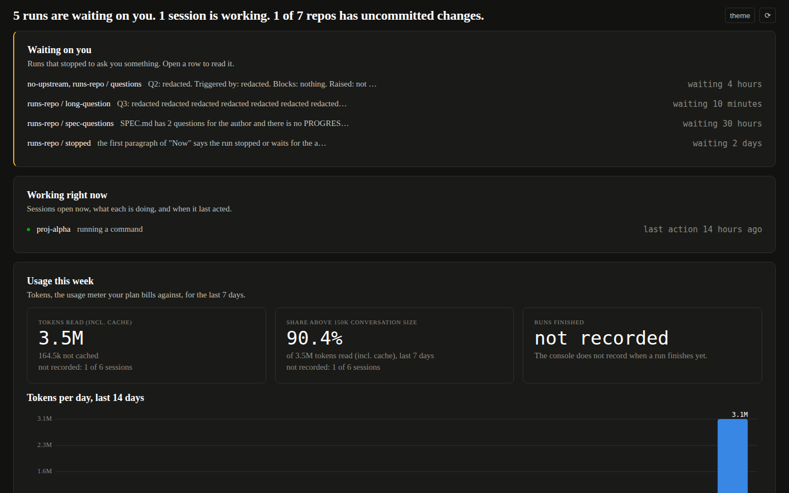
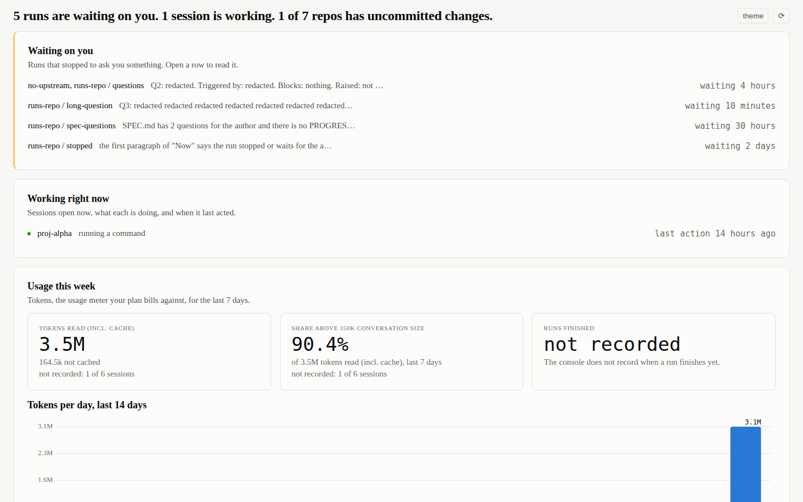
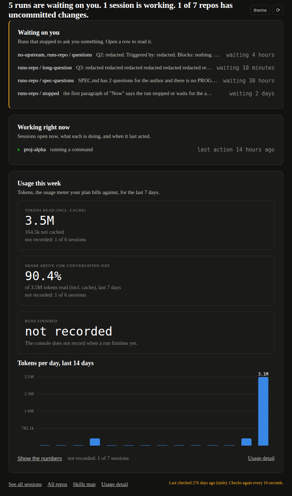
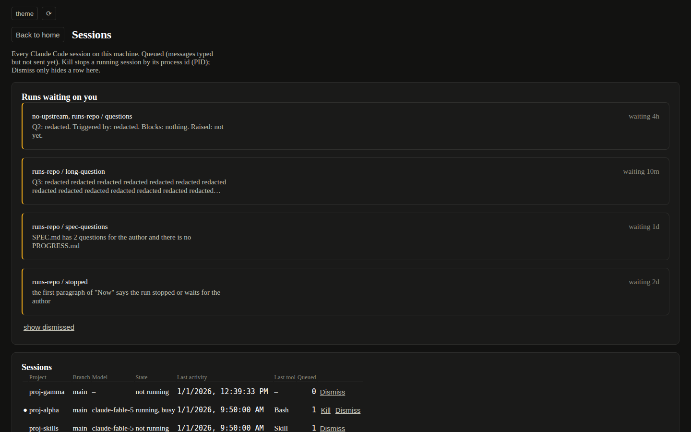
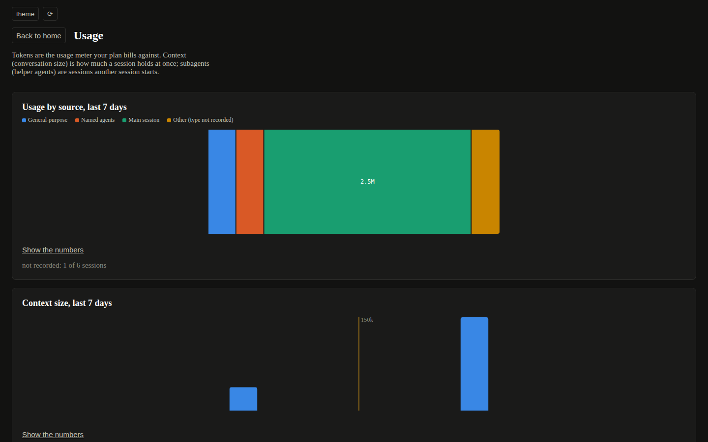
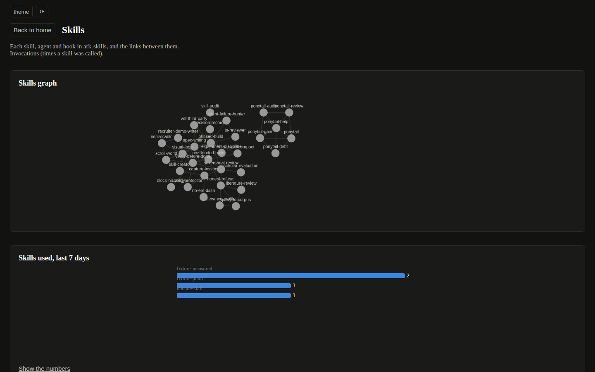

# Progress: ark-console v3, readable by someone who did not build it
Updated: 2026-10-04 23:20 EDT (from `date`)   Branch: ark-console claude/project-thread-05uini (stands in for feat/console-v3); ark-skills claude/project-thread-05uini (based on docs/console-v3-run 49e8f5c)   Last commit: ark-console 6570241

## Now
STOPPED at Phase 5, as the SPEC says. Phases 6 and 7 are not started. Two questions wait on the author (see Open questions); everything below is a proposal until that review.

## SPEC summary
UI.md v3 in ark-console. Phase 0 an audit script (banned words, size floors, contrast) run before anything changes; Phase 1 two levels (home cards, four detail pages, no tab strip); Phase 2 type and rhythm as literals; Phase 3 plain language on home; Phase 4 floors and contrast until the audit exits 0; Phase 5 STOP for the author's review. Phases 6 (mutants) and 7 (adversarial review) come after that round.

## How this run differs from the SPEC's setup (read first)
- Where it ran: a claude.ai cloud session (Linux container), not the author's Mac. Repos are fresh clones, not ~/dev. Chrome is the container's Chromium 141.0.7390.37, launched through a two-line wrapper that adds --no-sandbox (the container runs as root and Chromium refuses a sandbox as root); the wrapper lives in the session's scratch directory and is not committed. ARK_CHROME points at it. ~/dev/ark-skills is a symlink to the ark-skills clone so check-page.js's no-write check has its default path.
- Branches: the session may push only to claude/project-thread-05uini in each repo, so that branch stands in for the SPEC's feat/console-v3 (ark-console, based on main, which now holds docs/ui-v3-simple) and for docs/console-v3-run (ark-skills, based on docs/console-v3-run 49e8f5c).
- Model: every phase ran in this one session on one model. The SPEC's per-phase opus/sonnet split was not applied.
- Tests as root: test T21 and S9 make files unreadable with chmod and expect EACCES; root reads them anyway, so both fail as root. Run as the unprivileged user `nobody` from a copy in /tmp, the suite is 95 of 95. Every test count below is from the `nobody` run.
- "Both fixtures (scripts/make-fixtures.js)" is read as the two snapshots the page check serves: test/fixtures/snapshot.json (populated) and test/fixtures/snapshot-empty.json (empty). make-fixtures.js makes the transcripts those come from; it was not rerun.

## Before the SPEC: the merges
- ark-console main was at edadaa4, not the 46b8735 in the thread's state note: PR #1 (feat/efficiency) had been merged on 2026-10-01 19:06 EDT. feat/console-v2 already contained that branch's tip d6cb492, so the merge was clean (`git merge-tree` reported no conflict).
- Before merging: tests 95 of 95 (as `nobody`) and `node scripts/check-page.js` "all checks passed" on the trial merge.
- PR #3 merged feat/console-v2 into main with a merge commit: bf60dc4. PR #4 merged docs/ui-v3-simple (bc38b4e) with a merge commit: 8c770bb.
- Precondition: `git log --oneline -1 docs/UI.md` names bc38b4e; `grep -c "## 9. Minimum sizes" docs/UI.md` returns 1.

## Done and verified
- Phase 0, ark-console 17d3877: scripts/audit-ui.js. It uses check-page.js's own DevTools driver (now exported; check-page.js's main() runs only when it is the entry point) and serves both fixtures in both modes at 1440, 1100 and 820 wide. On home it reports UI.md section 8's banned words in visible text and in title, aria-label and SVG title text; on every view it reports section 9's floors (home card width, chart box, headline number block, row height, hit target, text measure as the widest rendered line in characters) and the contrast of every visible text node against the surface behind it (ancestor opacity included), plus page scroll on home at 1440x900 and horizontal scroll at every width. Before v3 the views are the one screen (as "home") and each tab panel.
  - `node scripts/audit-ui.js` exit code 1, 559 violations (captured as `$?`, no pipe). Full output, the before state, is in the appendix at the end of this file.
  - `node scripts/check-page.js` after the export change: "all checks passed", exit 0.
  - Canvas text (the skills graph's node labels) cannot be read from the DOM: its contrast is NOT MEASURED, and the audit says so on every view that has it.

### Contrast of every text token on every surface token, before (observed ratios)

| dark | --surface-0 #121211 | --surface-1 #1a1a19 | --surface-2 #232322 |
|---|---|---|---|
| --text-1 #ffffff | 18.74 | 17.42 | 15.73 |
| --text-2 #c3c2b7 | 10.46 | 9.72 | 8.78 |
| --text-3 #8a8a80 | 5.38 | 5.00 | 4.52 |
| --warning #fab219 | 10.22 | 9.49 | 8.57 |
| --critical #d03b3b | 3.90 | 3.62 | 3.27 |

| light | --surface-0 #f7f7f5 | --surface-1 #fcfcfb | --surface-2 #f0efec |
|---|---|---|---|
| --text-1 #0b0b0b | 18.35 | 19.17 | 17.12 |
| --text-2 #52514e | 7.40 | 7.73 | 6.90 |
| --text-3 #77766f | 4.25 | 4.44 | 3.97 |
| --warning #fab219 | 1.71 | 1.79 | 1.60 |
| --critical #d03b3b | 4.48 | 4.68 | 4.18 |

--warning and --critical are included because the page uses them as text: the stale snapshot line (--warning) and Kill on hover and in its dialog (--critical). Both are status tokens UI.md section 1 calls fixed and never themed; see Open questions.

- Phase 1, ark-console e7277dd: two levels. Home is three full-width stacked cards (Waiting on you, Working right now, Usage this week) and a footer with links to four detail pages (Sessions, Repos, Skills, Usage) and the status line. Each detail page has "Back to home" at its top left and a headline. Routing is the URL hash (#sessions, #repos, #skills, #usage; empty for home). Kill and Dismiss moved to the Sessions page; home has no control that acts.
  - check-page.js: 801 PASS, 1 FAIL (home at 1440x900 scrolls, 1014 > 900 on the many-sessions fixture). 10 mutants, 10 caught (one, p1-columns, first did nothing because of CSS cascade order; rerun with !important as p1-columns2, caught).
- Phase 2, ark-console c4b2165: type and rhythm as literals (15px body, 18/600 card titles, 24px headline, 34px headline numbers, 12px labels and axis text, 36px rows, home card padding 24 and radius 10, detail card padding 20 and radius 8, 56px header bar).
  - check-page.js on a copy of that commit: 860 PASS, 4 FAIL (two home no-scroll, two text measure on #status, which the 32em rule then fixed). 13 mutants, 13 caught.
- Phase 3, ark-console aa7f5f4: plain language on home. Header sentence "N runs are waiting on you. N sessions are working. N of M repos have uncommitted changes."; one explanation sentence per home card (62, 62 and 69 characters); waiting and working times in words ("waiting 4 hours", "last action 14 hours ago"); a working row says what the session is doing ("running a command"); status line "Last checked N ago (stale). Checks again every 10 seconds."; each detail page introduces its technical words once in parentheses.
  - check-page.js: 891 PASS, 2 FAIL (home no-scroll, both fixtures). 12 mutants, 12 caught; two needed a second try, both my mistakes in the mutant, not the check: p3-see-more failed "working card: the link reads" but my expect pattern did not name that line; p3-dirty edited the unknown-count branch of the header, which no fixture reaches, so it was rewritten as p3-dirty2 against the branch the fixtures use (caught). The unknown-count branch has no fixture: a gap, recorded below.
- Phase 4, ark-console 7bc197c: floors and contrast.
  - Light --text-3 darkened #77766f to #6c6b65, written into UI.md section 1 with its ratios. Status words use new text variants (open question 2). #status and the repo notes use --text-3 instead of literal gray (4.41 on cards in dark, 3.85 in light). A dimmed row's Dismiss word is drawn in --text-1 so it reads at 4.5 through opacity 0.6.
  - Every control at least 32 x 32. Usage page charts at least 220 tall. Prose and one-line rows held to 28em. The dollars reason moved from its table cell to a note under the totals table; in the cell it widened the table to 1241px (sideways scroll at 1100 and 820) and broke the 36px row.
  - Floor fallback: below 480px of card width, home's tokens-per-day chart is not drawn; the card shows its 14-day token total and "See the chart on the Usage page", and draws the chart again when the width allows. Checked at 520 wide.
  - Audit corrections, each a false reading I checked by hand: a line's width is now its glyph extent (Chrome reports two rects for one nowrap line, which was counted twice: 146 "characters" for a 450px box); text clipped by overflow is not measured; svg chart labels are not a line of prose (the chart card read as 230 characters); the token matrix lists the tokens used for words and counts a ratio below 4.5 as a violation (before, the matrix was information only).
  - `node scripts/audit-ui.js`: exit 1, 2 violations, both "page scroll on home at 1440x900" (open question 1). check-page.js: 910 PASS, 2 FAIL (the same no-scroll). 12 mutants, 12 caught (8 of them run the audit itself).
- Phase 5, ark-console 6570241:
  - Found while taking the screenshots: the route names are also element ids (table#sessions, table#repos, div#usage), and Chrome scrolled to that element a frame after the page was shown. Clicking "See all sessions" opened the Sessions page at scrollY 267 and "Usage detail" opened the Usage page at 1409 (its tables); the Usage screenshot came out blank. showPage now sets the top again after that frame; a new check takes each detail screenshot without scrolling and requires the headline in view at scrollY 0. Mutant (fix removed): caught, scrollY 267 and 1409.
  - The driver's full-page screenshot reset the page to its starting width, so docs/screenshot-820.png was 1440 wide. Fixed; a new check reads the PNG header (820 x 1388). Mutant: caught.
  - Unit tests as `nobody`: 95 of 95. check-page.js: 914 PASS, 2 FAIL (home no-scroll). audit-ui.js: exit 1, 2 violations (home no-scroll).

## Screenshots (Phase 5, from check-page.js on 6570241, fixture snapshot.json)

Taken in the Linux container with its Chromium, not on the Mac. One thing differs on the Mac: see "Not decided by UI.md" item 1 about the typeface.

Home, dark, 1440x900:



Home, light, 1440x900:



Home at 820 wide, dark, whole page:



Sessions detail, dark, 1440x900:



Usage detail, dark, 1440x900:



Skills detail, dark, 1440x900:



## Audit before and after, side by side (observed)

Before: Phase 0 (17d3877) on the v2 page. After: 6570241. Views map "home (one screen)" to home and each tab to its detail page. The after run uses the corrected measure described under Phase 4; the before run did not have it, so a before measure count may include the false readings that correction removed.

| fixture | mode | width | view | violations before | violations after | lowest ratio before | lowest ratio after |
|---|---|---|---|---|---|---|---|
| populated | dark | 1440 | home | 23 | 1 | 4.44 | 5.00 |
| populated | dark | 1440 | sessions | 7 | 0 | 4.44 | 5.00 |
| populated | dark | 1440 | repos | 1 | 0 | 4.75 | 5.00 |
| populated | dark | 1440 | skills | 2 | 0 | 5.00 | 5.00 |
| populated | dark | 1440 | usage | 17 | 0 | 5.00 | 5.00 |
| populated | dark | 1100 | home | 20 | 0 | 4.44 | 5.00 |
| populated | dark | 1100 | sessions | 7 | 0 | 4.44 | 5.00 |
| populated | dark | 1100 | repos | 1 | 0 | 4.75 | 5.00 |
| populated | dark | 1100 | skills | 2 | 0 | 5.00 | 5.00 |
| populated | dark | 1100 | usage | 16 | 0 | 5.00 | 5.00 |
| populated | dark | 820 | home | 20 | 0 | 4.44 | 5.00 |
| populated | dark | 820 | sessions | 7 | 0 | 4.44 | 5.00 |
| populated | dark | 820 | repos | 1 | 0 | 4.75 | 5.00 |
| populated | dark | 820 | skills | 2 | 0 | 5.00 | 5.00 |
| populated | dark | 820 | usage | 16 | 0 | 5.00 | 5.00 |
| populated | light | 1440 | home | 37 | 1 | 1.71 | 4.96 |
| populated | light | 1440 | sessions | 9 | 0 | 2.85 | 5.16 |
| populated | light | 1440 | repos | 4 | 0 | 3.68 | 5.21 |
| populated | light | 1440 | skills | 6 | 0 | 4.44 | 5.21 |
| populated | light | 1440 | usage | 21 | 0 | 4.25 | 4.98 |
| populated | light | 1100 | home | 34 | 0 | 1.71 | 4.96 |
| populated | light | 1100 | sessions | 9 | 0 | 2.85 | 5.16 |
| populated | light | 1100 | repos | 4 | 0 | 3.68 | 5.21 |
| populated | light | 1100 | skills | 6 | 0 | 4.44 | 5.21 |
| populated | light | 1100 | usage | 20 | 0 | 4.25 | 4.98 |
| populated | light | 820 | home | 34 | 0 | 1.71 | 4.96 |
| populated | light | 820 | sessions | 9 | 0 | 2.85 | 5.16 |
| populated | light | 820 | repos | 4 | 0 | 3.68 | 5.21 |
| populated | light | 820 | skills | 6 | 0 | 4.44 | 5.21 |
| populated | light | 820 | usage | 20 | 0 | 4.25 | 4.98 |
| empty | dark | 1440 | home | 11 | 0 | 5.00 | 5.00 |
| empty | dark | 1440 | sessions | 1 | 0 | 5.38 | 5.00 |
| empty | dark | 1440 | repos | 0 | 0 | 5.38 | 5.00 |
| empty | dark | 1440 | skills | 0 | 0 | 5.00 | 5.38 |
| empty | dark | 1440 | usage | 12 | 0 | 5.38 | 5.38 |
| empty | dark | 1100 | home | 8 | 0 | 5.00 | 5.00 |
| empty | dark | 1100 | sessions | 1 | 0 | 5.38 | 5.00 |
| empty | dark | 1100 | repos | 0 | 0 | 5.38 | 5.00 |
| empty | dark | 1100 | skills | 0 | 0 | 5.00 | 5.38 |
| empty | dark | 1100 | usage | 12 | 0 | 5.38 | 5.38 |
| empty | dark | 820 | home | 8 | 0 | 5.00 | 5.00 |
| empty | dark | 820 | sessions | 1 | 0 | 5.38 | 5.00 |
| empty | dark | 820 | repos | 0 | 0 | 5.38 | 5.00 |
| empty | dark | 820 | skills | 0 | 0 | 5.00 | 5.38 |
| empty | dark | 820 | usage | 13 | 0 | 5.38 | 5.38 |
| empty | light | 1440 | home | 23 | 0 | 1.71 | 4.96 |
| empty | light | 1440 | sessions | 3 | 0 | 4.25 | 5.21 |
| empty | light | 1440 | repos | 2 | 0 | 4.25 | 5.21 |
| empty | light | 1440 | skills | 2 | 0 | 4.25 | 4.98 |
| empty | light | 1440 | usage | 14 | 0 | 4.25 | 4.98 |
| empty | light | 1100 | home | 20 | 0 | 1.71 | 4.96 |
| empty | light | 1100 | sessions | 3 | 0 | 4.25 | 5.21 |
| empty | light | 1100 | repos | 2 | 0 | 4.25 | 5.21 |
| empty | light | 1100 | skills | 2 | 0 | 4.25 | 4.98 |
| empty | light | 1100 | usage | 14 | 0 | 4.25 | 4.98 |
| empty | light | 820 | home | 20 | 0 | 1.71 | 4.96 |
| empty | light | 820 | sessions | 3 | 0 | 4.25 | 5.21 |
| empty | light | 820 | repos | 2 | 0 | 4.25 | 5.21 |
| empty | light | 820 | skills | 2 | 0 | 4.25 | 4.98 |
| empty | light | 820 | usage | 15 | 0 | 4.25 | 4.98 |
| all | | | | 559 | 2 | | |

Contrast of every text token on every surface token, after (before is the table above):

| dark | --surface-0 #121211 | --surface-1 #1a1a19 | --surface-2 #232322 |
|---|---|---|---|
| --text-1 #ffffff | 18.74 | 17.42 | 15.73 |
| --text-2 #c3c2b7 | 10.46 | 9.72 | 8.78 |
| --text-3 #8a8a80 (unchanged) | 5.38 | 5.00 | 4.52 |
| --warning-text #fab219 | 10.22 | 9.49 | 8.57 |
| --critical-text #db6868 | 5.53 | 5.14 | 4.64 |

| light | --surface-0 #f7f7f5 | --surface-1 #fcfcfb | --surface-2 #f0efec |
|---|---|---|---|
| --text-1 #0b0b0b | 18.35 | 19.17 | 17.12 |
| --text-2 #52514e | 7.40 | 7.73 | 6.90 |
| --text-3 #6c6b65 (was #77766f) | 4.98 | 5.21 | 4.65 |
| --warning-text #8c640e | 4.96 | 5.19 | 4.63 |
| --critical-text #c43737 | 4.96 | 5.18 | 4.62 |

The four status colors (--good #0ca30c, --warning #fab219, --serious #ec835a, --critical #d03b3b) are unchanged and no longer draw words.

## Open questions (asked in the thread as decision cards; no answer yet)

1. Home does not fit one 1440x900 screen at UI.md's sizes. Measured home height: 1098 on the populated fixture, 1282 on the six-running fixture. Options: allow home to scroll (recommended: keeps every floor; the no-scroll check would become no sideways scroll), Waiting and Working side by side, cap the rows, or smaller sizes. Until answered, the no-scroll check stays and fails; it is not deleted. It is the only audit item left.
2. Status colors as text. UI.md section 6 turns the stale line --warning and section 7 turns Kill --critical; section 1 says status colors never change; section 9 says every text color is at least 4.5. As text, --warning is 1.71 on the light page and --critical 3.27 to 3.90 on dark. Running on the recommended option: text variants --warning-text and --critical-text (values above), status colors unchanged for dots and borders. Alternatives: draw status words in ink with a status-colored dot or border, or exempt status text (the audit could not exit 0).

## Not decided by UI.md: values I chose, and why

1. Typeface: none. UI.md names none and the page has never set one, so body text renders in the browser default, a serif (Times New Roman in this container, Times on a Mac). Only the numeric style has a stack. Not changed; flagged because the screenshots show it and it is likely not what anyone intends.
2. HOME_WAITING_MAX = 5 waiting rows on home, then "See all N runs". UI.md says "at most five" for the working card; I used the same for waiting.
3. Runs sharing one open item share one home row (E4 grouping from v2), so "5 runs are waiting on you" shows 4 rows on the fixture.
4. Run Dismiss moved to the Sessions page with Kill and session Dismiss (UI.md section 7: home is for reading).
5. The general-purpose share tile left home (it is still in the Usage page's chart 2). Home's three numbers: tokens read this week, share above 150k conversation size, runs finished.
6. Runs finished shows "not recorded" with "The console does not record when a run finishes yet." The indexer has no finish time; adding one would change what it collects (stop-and-ask), so I did not.
7. Text measure: max-width 28em on prose and one-line rows. 76ch let 97 characters through (ch is the width of "0"); 32em still let 77 to 83 through on narrow-letter text; 28em measured at most 76 everywhere.
8. Direct labels and axis text 12px (UI.md says label size; this is its 12px label).
9. The tool-to-activity map for the working row (Bash "running a command", Read "reading files", Edit and MultiEdit "editing files", Write "writing files", and so on; idle sessions "idle, waiting for a message").
10. Status line wording: "Last checked N ago (stale). Checks again every 10 seconds." with the snapshot time as its hover title.
11. Detail-page glosses: Sessions (Queued, PID, Dismiss), Repos (Dirty, Behind, Ahead), Skills (Invocations), Usage (Tokens, Context, subagents).
12. The explanation sentences: waiting "Runs that stopped to ask you something. Open a row to read it.", working "Sessions open now, what each is doing, and when it last acted.", usage "Tokens, the usage meter your plan bills against, for the last 7 days."
13. Hit targets: min-height and min-width 32px on every button and link; links are inline-flex so the box is the target.
14. Usage page charts: height at least 220 (chart 2 was 44, chart 3 was 140, chart 4 24 a row). Chart 2 is one 100% bar, so the bar now fills 212 of the 220. The drawings keep their 600-unit viewBox and are centered in the 1350px box (visible in the Usage screenshot); the floor is met by the box, not by the drawing's width.
15. Floor fallback threshold: chart 1 below 480px of card width (a viewport under about 576px). Only chart 1 has a fallback; the Usage page charts shrink by viewBox scaling below that width. Not reached at 1440, 1100 or 820.
16. The dollars reason moved out of its cell into a note: "Dollars: NOT AVAILABLE, because ..." word for word from the JSON.
17. Stale rows keep opacity 0.6 (a v2 literal); their Dismiss word is drawn in --text-1 to stay at 4.5.

## Gaps and findings, not fixed

- The header's unknown-count branch ("with uncommitted changes" when some repos could not be read) is reached by no fixture, so no check covers it.
- The round trip keeps sort state only because there are no sort controls; the check proves the state survives, not that a user could change it.
- Skills used chart: a bar's label overlaps the bar below it (visible in the Skills screenshot). Present before v3 at the same geometry.
- Skills graph node labels overlap (Cytoscape canvas); their contrast is NOT MEASURED.
- --text-3 in dark is 4.52 on --surface-2, inside 0.02 of the floor. It passes, so it was not changed.
- Nothing ran on the author's Mac: NOT RUN.

## Mutants by phase (each a one-line edit in a copy; "caught" means the named check failed)

| phase | mutants | caught | notes |
|---|---|---|---|
| 1 | 10 | 10 | p1-columns did nothing (cascade order); rerun as p1-columns2, caught |
| 2 | 13 | 13 | |
| 3 | 12 | 12 | p3-see-more's expect pattern was wrong (the check did fail); p3-dirty hit an unreached branch, rewritten as p3-dirty2, caught |
| 4 | 12 | 12 | 8 run the audit: text-3, warning-text, status-raw, note-gray, dismiss-dim, hit, measure, chartmin; 4 run the page check |
| 5 | 2 | 2 | scroll jump, screenshot width |

## Appendix: audit output before (Phase 0, 2026-10-04 22:37 EDT)
```text
# UI audit (UI.md sections 3, 8 and 9), observed values

## Contrast of every text token on every surface token

dark:
  text token            --surface-0 #121211     --surface-1 #1a1a19     --surface-2 #232322     
  --text-1 #ffffff      18.74                   17.42                   15.73                   
  --text-2 #c3c2b7      10.46                   9.72                    8.78                    
  --text-3 #8a8a80      5.38                    5.00                    4.52                    
  --warning #fab219     10.22                   9.49                    8.57                    
  --critical #d03b3b    3.90 BELOW              3.62 BELOW              3.27 BELOW              

light:
  text token            --surface-0 #f7f7f5     --surface-1 #fcfcfb     --surface-2 #f0efec     
  --text-1 #0b0b0b      18.35                   19.17                   17.12                   
  --text-2 #52514e      7.40                    7.73                    6.90                    
  --text-3 #77766f      4.25 BELOW              4.44 BELOW              3.97 BELOW              
  --warning #fab219     1.71 BELOW              1.79 BELOW              1.60 BELOW              
  --critical #d03b3b    4.48 BELOW              4.68                    4.18 BELOW              

## Violations, by fixture, mode, width and view

### populated, dark, 1440px, home (one screen, sessions tab selected): 23 violation(s)
- banned word "dirty" in visible text: "... 5 waiting on you, 7 repos (1 dirty) theme ⟳ Snapshot from 1/2/2..."
- banned word "subagent" in visible text: "...ns SHARE FROM GENERAL-PURPOSE SUBAGENTS 10.6% last 24h not recorded:..."
- banned word "model identifier" in visible text: "...or the author proj-alpha main claude-fable-5 last tool Bash 14h ago Kill s..."
- home card width: .home-card is no home card on the page (want >= 420px)
- chart content box: div#chart-tokens-per-day svg is 424.7 x 160 (want >= 480 x 220)
- headline number block: div.stat-tile[data-tile=tokens-24h] is 142.2 x 182.2 (want >= 220 x 96)
- headline number block: div.stat-tile[data-tile=above-150k] is 142.2 x 182.2 (want >= 220 x 96)
- headline number block: div.stat-tile[data-tile=general-purpose-share] is 142.2 x 182.2 (want >= 220 x 96)
- row height: ul#running-rows li.running-row is 24px (want >= 36px)
- row height: table#sessions tr is 28px (want >= 36px) x5
- row height: table#sessions tr.stale is 28px (want >= 36px)
- hit target: button#theme-toggle is 55 x 28 (want >= 32 x 32)
- hit target: button#refresh-button is 29.7 x 28 (want >= 32 x 32)
- hit target: ul#running-rows button.kill-button is 25.3 x 24 (want >= 32 x 32)
- hit target: button#show-dismissed-attention is 99.8 x 24 (want >= 32 x 32)
- hit target: div#chart-tokens-per-day button.chart-toggle is 28.2 x 24 (want >= 32 x 32)
- hit target: button#tab-skills is 30.3 x 33 (want >= 32 x 32)
- hit target: table#sessions button.dismiss-button is 53.5 x 24 (want >= 32 x 32) x6
- hit target: table#sessions button.kill-button is 25.3 x 24 (want >= 32 x 32)
- hit target: button#older-toggle is 91.6 x 24 (want >= 32 x 32)
- hit target: button#show-dismissed-sessions is 99.8 x 24 (want >= 32 x 32)
- text measure: div#waiting div.run-line2 is 139 characters on its widest line (want <= 76)
- contrast 4.44:1 (want >= 4.5): table#sessions button.dismiss-button, 13px rgb(195, 194, 183) on rgb(18, 18, 17) at opacity 0.6, "Dismiss"

### populated, dark, 1440px, tab sessions: 7 violation(s)
- row height: table#sessions tr is 28px (want >= 36px) x5
- row height: table#sessions tr.stale is 28px (want >= 36px)
- hit target: table#sessions button.dismiss-button is 53.5 x 24 (want >= 32 x 32) x6
- hit target: table#sessions button.kill-button is 25.3 x 24 (want >= 32 x 32)
- hit target: button#older-toggle is 91.6 x 24 (want >= 32 x 32)
- hit target: button#show-dismissed-sessions is 99.8 x 24 (want >= 32 x 32)
- contrast 4.44:1 (want >= 4.5): table#sessions button.dismiss-button, 13px rgb(195, 194, 183) on rgb(18, 18, 17) at opacity 0.6, "Dismiss"

### populated, dark, 1440px, tab repos: 1 violation(s)
- row height: table#repos tr is 28px (want >= 36px) x7

### populated, dark, 1440px, tab skills: 2 violation(s)
- chart content box: div#chart-skills-used-tab svg is 1358 x 80 (want >= 480 x 220)
- hit target: div#chart-skills-used-tab button.chart-toggle is 28.2 x 24 (want >= 32 x 32)
- note: canvas text (the skills graph labels) is not measured for contrast: NOT MEASURED

### populated, dark, 1440px, tab usage: 17 violation(s)
- chart content box: div#usage-charts svg is 1358 x 44 (want >= 480 x 220)
- chart content box: div#usage-charts svg is 1358 x 140 (want >= 480 x 220)
- chart content box: div#usage-charts svg is 1358 x 80 (want >= 480 x 220)
- row height: div#usage tr is 28px (want >= 36px) x66
- hit target: div#usage-charts button.chart-toggle is 28.2 x 24 (want >= 32 x 32) x3
- text measure: ul#usage-definitions li is 151 characters on its widest line (want <= 76)
- text measure: ul#usage-definitions li is 107 characters on its widest line (want <= 76)
- text measure: ul#usage-definitions li is 104 characters on its widest line (want <= 76)
- text measure: ul#usage-definitions li is 122 characters on its widest line (want <= 76)
- text measure: ul#usage-definitions li is 111 characters on its widest line (want <= 76)
- text measure: ul#usage-definitions li is 164 characters on its widest line (want <= 76)
- text measure: div#usage caption is 149 characters on its widest line (want <= 76) x2
- text measure: div#usage td is 175 characters on its widest line (want <= 76) x2
- text measure: div#usage p.never-used is 212 characters on its widest line (want <= 76)
- text measure: div#usage p.never-used is 218 characters on its widest line (want <= 76)
- text measure: p#usage-cost is 227 characters on its widest line (want <= 76)
- text measure: p#usage-skipped is 101 characters on its widest line (want <= 76)

### populated, dark, 1100px, home (one screen, sessions tab selected): 20 violation(s)
- banned word "dirty" in visible text: "... 5 waiting on you, 7 repos (1 dirty) theme ⟳ Snapshot from 1/2/2..."
- banned word "subagent" in visible text: "...ns SHARE FROM GENERAL-PURPOSE SUBAGENTS 10.6% last 24h not recorded:..."
- banned word "model identifier" in visible text: "...or the author proj-alpha main claude-fable-5 last tool Bash 14h ago Kill s..."
- home card width: .home-card is no home card on the page (want >= 420px)
- chart content box: div#chart-tokens-per-day svg is 1018 x 160 (want >= 480 x 220)
- row height: ul#running-rows li.running-row is 24px (want >= 36px)
- row height: table#sessions tr is 28px (want >= 36px) x5
- row height: table#sessions tr.stale is 28px (want >= 36px)
- hit target: button#theme-toggle is 55 x 28 (want >= 32 x 32)
- hit target: button#refresh-button is 29.7 x 28 (want >= 32 x 32)
- hit target: ul#running-rows button.kill-button is 25.3 x 24 (want >= 32 x 32)
- hit target: button#show-dismissed-attention is 99.8 x 24 (want >= 32 x 32)
- hit target: div#chart-tokens-per-day button.chart-toggle is 28.2 x 24 (want >= 32 x 32)
- hit target: button#tab-skills is 30.3 x 33 (want >= 32 x 32)
- hit target: table#sessions button.dismiss-button is 53.5 x 24 (want >= 32 x 32) x6
- hit target: table#sessions button.kill-button is 25.3 x 24 (want >= 32 x 32)
- hit target: button#older-toggle is 91.6 x 24 (want >= 32 x 32)
- hit target: button#show-dismissed-sessions is 99.8 x 24 (want >= 32 x 32)
- text measure: div#waiting div.run-line2 is 139 characters on its widest line (want <= 76)
- contrast 4.44:1 (want >= 4.5): table#sessions button.dismiss-button, 13px rgb(195, 194, 183) on rgb(18, 18, 17) at opacity 0.6, "Dismiss"
- note: canvas text (the skills graph labels) is not measured for contrast: NOT MEASURED

### populated, dark, 1100px, tab sessions: 7 violation(s)
- row height: table#sessions tr is 28px (want >= 36px) x5
- row height: table#sessions tr.stale is 28px (want >= 36px)
- hit target: table#sessions button.dismiss-button is 53.5 x 24 (want >= 32 x 32) x6
- hit target: table#sessions button.kill-button is 25.3 x 24 (want >= 32 x 32)
- hit target: button#older-toggle is 91.6 x 24 (want >= 32 x 32)
- hit target: button#show-dismissed-sessions is 99.8 x 24 (want >= 32 x 32)
- contrast 4.44:1 (want >= 4.5): table#sessions button.dismiss-button, 13px rgb(195, 194, 183) on rgb(18, 18, 17) at opacity 0.6, "Dismiss"

### populated, dark, 1100px, tab repos: 1 violation(s)
- row height: table#repos tr is 28px (want >= 36px) x7

### populated, dark, 1100px, tab skills: 2 violation(s)
- chart content box: div#chart-skills-used-tab svg is 1018 x 80 (want >= 480 x 220)
- hit target: div#chart-skills-used-tab button.chart-toggle is 28.2 x 24 (want >= 32 x 32)
- note: canvas text (the skills graph labels) is not measured for contrast: NOT MEASURED

### populated, dark, 1100px, tab usage: 16 violation(s)
- chart content box: div#usage-charts svg is 1018 x 44 (want >= 480 x 220)
- chart content box: div#usage-charts svg is 1018 x 140 (want >= 480 x 220)
- chart content box: div#usage-charts svg is 1018 x 80 (want >= 480 x 220)
- row height: div#usage tr is 28px (want >= 36px) x66
- hit target: div#usage-charts button.chart-toggle is 28.2 x 24 (want >= 32 x 32) x3
- text measure: ul#usage-definitions li is 151 characters on its widest line (want <= 76)
- text measure: ul#usage-definitions li is 107 characters on its widest line (want <= 76)
- text measure: ul#usage-definitions li is 104 characters on its widest line (want <= 76)
- text measure: ul#usage-definitions li is 122 characters on its widest line (want <= 76)
- text measure: ul#usage-definitions li is 111 characters on its widest line (want <= 76)
- text measure: ul#usage-definitions li is 143 characters on its widest line (want <= 76)
- text measure: div#usage caption is 149 characters on its widest line (want <= 76) x2
- text measure: div#usage td is 175 characters on its widest line (want <= 76) x2
- text measure: div#usage p.never-used is 161 characters on its widest line (want <= 76) x2
- text measure: p#usage-cost is 170 characters on its widest line (want <= 76)
- text measure: p#usage-skipped is 101 characters on its widest line (want <= 76)

### populated, dark, 820px, home (one screen, sessions tab selected): 20 violation(s)
- banned word "dirty" in visible text: "... 5 waiting on you, 7 repos (1 dirty) theme ⟳ Snapshot from 1/2/2..."
- banned word "subagent" in visible text: "...ns SHARE FROM GENERAL-PURPOSE SUBAGENTS 10.6% last 24h not recorded:..."
- banned word "model identifier" in visible text: "...or the author proj-alpha main claude-fable-5 last tool Bash 14h ago Kill s..."
- home card width: .home-card is no home card on the page (want >= 420px)
- chart content box: div#chart-tokens-per-day svg is 738 x 160 (want >= 480 x 220)
- row height: ul#running-rows li.running-row is 24px (want >= 36px)
- row height: table#sessions tr is 28px (want >= 36px) x5
- row height: table#sessions tr.stale is 28px (want >= 36px)
- hit target: button#theme-toggle is 55 x 28 (want >= 32 x 32)
- hit target: button#refresh-button is 29.7 x 28 (want >= 32 x 32)
- hit target: ul#running-rows button.kill-button is 25.3 x 24 (want >= 32 x 32)
- hit target: button#show-dismissed-attention is 99.8 x 24 (want >= 32 x 32)
- hit target: div#chart-tokens-per-day button.chart-toggle is 28.2 x 24 (want >= 32 x 32)
- hit target: button#tab-skills is 30.3 x 33 (want >= 32 x 32)
- hit target: table#sessions button.dismiss-button is 53.5 x 24 (want >= 32 x 32) x6
- hit target: table#sessions button.kill-button is 25.3 x 24 (want >= 32 x 32)
- hit target: button#older-toggle is 91.6 x 24 (want >= 32 x 32)
- hit target: button#show-dismissed-sessions is 99.8 x 24 (want >= 32 x 32)
- text measure: div#waiting div.run-line2 is 128 characters on its widest line (want <= 76)
- contrast 4.44:1 (want >= 4.5): table#sessions button.dismiss-button, 13px rgb(195, 194, 183) on rgb(18, 18, 17) at opacity 0.6, "Dismiss"
- note: canvas text (the skills graph labels) is not measured for contrast: NOT MEASURED

### populated, dark, 820px, tab sessions: 7 violation(s)
- row height: table#sessions tr is 28px (want >= 36px) x5
- row height: table#sessions tr.stale is 28px (want >= 36px)
- hit target: table#sessions button.dismiss-button is 53.5 x 24 (want >= 32 x 32) x6
- hit target: table#sessions button.kill-button is 25.3 x 24 (want >= 32 x 32)
- hit target: button#older-toggle is 91.6 x 24 (want >= 32 x 32)
- hit target: button#show-dismissed-sessions is 99.8 x 24 (want >= 32 x 32)
- contrast 4.44:1 (want >= 4.5): table#sessions button.dismiss-button, 13px rgb(195, 194, 183) on rgb(18, 18, 17) at opacity 0.6, "Dismiss"

### populated, dark, 820px, tab repos: 1 violation(s)
- row height: table#repos tr is 28px (want >= 36px) x7

### populated, dark, 820px, tab skills: 2 violation(s)
- chart content box: div#chart-skills-used-tab svg is 738 x 80 (want >= 480 x 220)
- hit target: div#chart-skills-used-tab button.chart-toggle is 28.2 x 24 (want >= 32 x 32)
- note: canvas text (the skills graph labels) is not measured for contrast: NOT MEASURED

### populated, dark, 820px, tab usage: 16 violation(s)
- chart content box: div#usage-charts svg is 738 x 44 (want >= 480 x 220)
- chart content box: div#usage-charts svg is 738 x 140 (want >= 480 x 220)
- chart content box: div#usage-charts svg is 738 x 80 (want >= 480 x 220)
- row height: div#usage tr is 28px (want >= 36px) x66
- hit target: div#usage-charts button.chart-toggle is 28.2 x 24 (want >= 32 x 32) x3
- text measure: ul#usage-definitions li is 114 characters on its widest line (want <= 76)
- text measure: ul#usage-definitions li is 107 characters on its widest line (want <= 76)
- text measure: ul#usage-definitions li is 104 characters on its widest line (want <= 76)
- text measure: ul#usage-definitions li is 117 characters on its widest line (want <= 76)
- text measure: ul#usage-definitions li is 111 characters on its widest line (want <= 76)
- text measure: ul#usage-definitions li is 110 characters on its widest line (want <= 76)
- text measure: div#usage caption is 149 characters on its widest line (want <= 76) x2
- text measure: div#usage td is 175 characters on its widest line (want <= 76) x2
- text measure: div#usage p.never-used is 120 characters on its widest line (want <= 76) x2
- text measure: p#usage-cost is 125 characters on its widest line (want <= 76)
- text measure: p#usage-skipped is 101 characters on its widest line (want <= 76)

### populated, light, 1440px, home (one screen, sessions tab selected): 37 violation(s)
- banned word "dirty" in visible text: "... 5 waiting on you, 7 repos (1 dirty) theme ⟳ Snapshot from 1/2/2..."
- banned word "subagent" in visible text: "...ns SHARE FROM GENERAL-PURPOSE SUBAGENTS 10.6% last 24h not recorded:..."
- banned word "model identifier" in visible text: "...or the author proj-alpha main claude-fable-5 last tool Bash 14h ago Kill s..."
- home card width: .home-card is no home card on the page (want >= 420px)
- chart content box: div#chart-tokens-per-day svg is 424.7 x 160 (want >= 480 x 220)
- headline number block: div.stat-tile[data-tile=tokens-24h] is 142.2 x 182.2 (want >= 220 x 96)
- headline number block: div.stat-tile[data-tile=above-150k] is 142.2 x 182.2 (want >= 220 x 96)
- headline number block: div.stat-tile[data-tile=general-purpose-share] is 142.2 x 182.2 (want >= 220 x 96)
- row height: ul#running-rows li.running-row is 24px (want >= 36px)
- row height: table#sessions tr is 28px (want >= 36px) x5
- row height: table#sessions tr.stale is 28px (want >= 36px)
- hit target: button#theme-toggle is 55 x 28 (want >= 32 x 32)
- hit target: button#refresh-button is 29.7 x 28 (want >= 32 x 32)
- hit target: ul#running-rows button.kill-button is 25.3 x 24 (want >= 32 x 32)
- hit target: button#show-dismissed-attention is 99.8 x 24 (want >= 32 x 32)
- hit target: div#chart-tokens-per-day button.chart-toggle is 28.2 x 24 (want >= 32 x 32)
- hit target: button#tab-skills is 30.3 x 33 (want >= 32 x 32)
- hit target: table#sessions button.dismiss-button is 53.5 x 24 (want >= 32 x 32) x6
- hit target: table#sessions button.kill-button is 25.3 x 24 (want >= 32 x 32)
- hit target: button#older-toggle is 91.6 x 24 (want >= 32 x 32)
- hit target: button#show-dismissed-sessions is 99.8 x 24 (want >= 32 x 32)
- text measure: div#waiting div.run-line2 is 139 characters on its widest line (want <= 76)
- contrast 1.71:1 (want >= 4.5): p#status, 12px rgb(250, 178, 25) on rgb(247, 247, 245), "Snapshot from" x2
- contrast 1.71:1 (want >= 4.5): p#status span, 12px rgb(250, 178, 25) on rgb(247, 247, 245), "1/2/2026, 12:00:00 AM"
- contrast 1.71:1 (want >= 4.5): p#status span.stale-marker, 12px rgb(250, 178, 25) on rgb(247, 247, 245), "stale"
- contrast 4.25:1 (want >= 4.5): h2#attention-eyebrow, 11px rgb(119, 118, 111) on rgb(247, 247, 245), "Attention"
- contrast 4.44:1 (want >= 4.5): div#waiting span.run-age, 13px rgb(119, 118, 111) on rgb(252, 252, 251), "waiting 4h" x4
- contrast 4.25:1 (want >= 4.5): h2#usage-eyebrow, 11px rgb(119, 118, 111) on rgb(247, 247, 245), "Usage"
- contrast 4.44:1 (want >= 4.5): div.tile-label, 11px rgb(119, 118, 111) on rgb(252, 252, 251), "tokens read (incl. cache)" x3
- contrast 4.44:1 (want >= 4.5): div.tile-context, 13px rgb(119, 118, 111) on rgb(252, 252, 251), "142.8k not cached" x3
- contrast 4.44:1 (want >= 4.5): div.tile-note, 13px rgb(119, 118, 111) on rgb(252, 252, 251), "not recorded: 1 of 5 sessions" x3
- contrast 4.44:1 (want >= 4.5): div#chart-tokens-per-day h3.chart-title, 12px rgb(119, 118, 111) on rgb(252, 252, 251), "Tokens per day, last 14 days"
- contrast 4.44:1 (want >= 4.5): div#chart-tokens-per-day text.chart-axis-text, 11px rgb(119, 118, 111) on rgb(252, 252, 251), "782.1k" x4
- contrast 4.44:1 (want >= 4.5): div#chart-tokens-per-day p.chart-note, 13px rgb(119, 118, 111) on rgb(252, 252, 251), "not recorded: 1 of 7 sessions"
- contrast 4.25:1 (want >= 4.5): table#sessions th, 12px rgb(119, 118, 111) on rgb(247, 247, 245), "Project" x6
- contrast 4.25:1 (want >= 4.5): table#sessions th.count, 12px rgb(119, 118, 111) on rgb(247, 247, 245), "Queued"
- contrast 2.85:1 (want >= 4.5): table#sessions button.dismiss-button, 13px rgb(82, 81, 78) on rgb(247, 247, 245) at opacity 0.6, "Dismiss"
- note: canvas text (the skills graph labels) is not measured for contrast: NOT MEASURED

### populated, light, 1440px, tab sessions: 9 violation(s)
- row height: table#sessions tr is 28px (want >= 36px) x5
- row height: table#sessions tr.stale is 28px (want >= 36px)
- hit target: table#sessions button.dismiss-button is 53.5 x 24 (want >= 32 x 32) x6
- hit target: table#sessions button.kill-button is 25.3 x 24 (want >= 32 x 32)
- hit target: button#older-toggle is 91.6 x 24 (want >= 32 x 32)
- hit target: button#show-dismissed-sessions is 99.8 x 24 (want >= 32 x 32)
- contrast 4.25:1 (want >= 4.5): table#sessions th, 12px rgb(119, 118, 111) on rgb(247, 247, 245), "Project" x6
- contrast 4.25:1 (want >= 4.5): table#sessions th.count, 12px rgb(119, 118, 111) on rgb(247, 247, 245), "Queued"
- contrast 2.85:1 (want >= 4.5): table#sessions button.dismiss-button, 13px rgb(82, 81, 78) on rgb(247, 247, 245) at opacity 0.6, "Dismiss"

### populated, light, 1440px, tab repos: 4 violation(s)
- row height: table#repos tr is 28px (want >= 36px) x7
- contrast 4.25:1 (want >= 4.5): table#repos th, 12px rgb(119, 118, 111) on rgb(247, 247, 245), "Repo" x3
- contrast 4.25:1 (want >= 4.5): table#repos th.count, 12px rgb(119, 118, 111) on rgb(247, 247, 245), "Behind" x2
- contrast 3.68:1 (want >= 4.5): table#repos span.note, 12px rgb(128, 128, 128) on rgb(247, 247, 245), "error" x10

### populated, light, 1440px, tab skills: 6 violation(s)
- chart content box: div#chart-skills-used-tab svg is 1358 x 80 (want >= 480 x 220)
- hit target: div#chart-skills-used-tab button.chart-toggle is 28.2 x 24 (want >= 32 x 32)
- contrast 4.44:1 (want >= 4.5): div#skills-graph-card h3.chart-title, 12px rgb(119, 118, 111) on rgb(252, 252, 251), "Skills graph"
- contrast 4.44:1 (want >= 4.5): div#chart-skills-used-tab h3.chart-title, 12px rgb(119, 118, 111) on rgb(252, 252, 251), "Skills used, last 7 days"
- contrast 4.44:1 (want >= 4.5): div#chart-skills-used-tab text.chart-axis-text, 11px rgb(119, 118, 111) on rgb(252, 252, 251), "fixture-measured" x3
- contrast 4.44:1 (want >= 4.5): div#chart-skills-used-tab p.chart-note, 13px rgb(119, 118, 111) on rgb(252, 252, 251), "Never fired in the last 7 days: fixture-"
- note: canvas text (the skills graph labels) is not measured for contrast: NOT MEASURED

### populated, light, 1440px, tab usage: 21 violation(s)
- chart content box: div#usage-charts svg is 1358 x 44 (want >= 480 x 220)
- chart content box: div#usage-charts svg is 1358 x 140 (want >= 480 x 220)
- chart content box: div#usage-charts svg is 1358 x 80 (want >= 480 x 220)
- row height: div#usage tr is 28px (want >= 36px) x66
- hit target: div#usage-charts button.chart-toggle is 28.2 x 24 (want >= 32 x 32) x3
- text measure: ul#usage-definitions li is 151 characters on its widest line (want <= 76)
- text measure: ul#usage-definitions li is 107 characters on its widest line (want <= 76)
- text measure: ul#usage-definitions li is 104 characters on its widest line (want <= 76)
- text measure: ul#usage-definitions li is 122 characters on its widest line (want <= 76)
- text measure: ul#usage-definitions li is 111 characters on its widest line (want <= 76)
- text measure: ul#usage-definitions li is 164 characters on its widest line (want <= 76)
- text measure: div#usage caption is 149 characters on its widest line (want <= 76) x2
- text measure: div#usage td is 175 characters on its widest line (want <= 76) x2
- text measure: div#usage p.never-used is 212 characters on its widest line (want <= 76)
- text measure: div#usage p.never-used is 218 characters on its widest line (want <= 76)
- text measure: p#usage-cost is 227 characters on its widest line (want <= 76)
- text measure: p#usage-skipped is 101 characters on its widest line (want <= 76)
- contrast 4.44:1 (want >= 4.5): div#usage-charts h3.chart-title, 12px rgb(119, 118, 111) on rgb(252, 252, 251), "Usage by source, last 7 days" x3
- contrast 4.44:1 (want >= 4.5): div#usage-charts p.chart-note, 13px rgb(119, 118, 111) on rgb(252, 252, 251), "not recorded: 1 of 6 sessions" x3
- contrast 4.44:1 (want >= 4.5): div#usage-charts text.chart-axis-text, 11px rgb(119, 118, 111) on rgb(252, 252, 251), "150k" x4
- contrast 4.25:1 (want >= 4.5): div#usage th, 12px rgb(119, 118, 111) on rgb(247, 247, 245), "Measure" x58

### populated, light, 1100px, home (one screen, sessions tab selected): 34 violation(s)
- banned word "dirty" in visible text: "... 5 waiting on you, 7 repos (1 dirty) theme ⟳ Snapshot from 1/2/2..."
- banned word "subagent" in visible text: "...ns SHARE FROM GENERAL-PURPOSE SUBAGENTS 10.6% last 24h not recorded:..."
- banned word "model identifier" in visible text: "...or the author proj-alpha main claude-fable-5 last tool Bash 14h ago Kill s..."
- home card width: .home-card is no home card on the page (want >= 420px)
- chart content box: div#chart-tokens-per-day svg is 1018 x 160 (want >= 480 x 220)
- row height: ul#running-rows li.running-row is 24px (want >= 36px)
- row height: table#sessions tr is 28px (want >= 36px) x5
- row height: table#sessions tr.stale is 28px (want >= 36px)
- hit target: button#theme-toggle is 55 x 28 (want >= 32 x 32)
- hit target: button#refresh-button is 29.7 x 28 (want >= 32 x 32)
- hit target: ul#running-rows button.kill-button is 25.3 x 24 (want >= 32 x 32)
- hit target: button#show-dismissed-attention is 99.8 x 24 (want >= 32 x 32)
- hit target: div#chart-tokens-per-day button.chart-toggle is 28.2 x 24 (want >= 32 x 32)
- hit target: button#tab-skills is 30.3 x 33 (want >= 32 x 32)
- hit target: table#sessions button.dismiss-button is 53.5 x 24 (want >= 32 x 32) x6
- hit target: table#sessions button.kill-button is 25.3 x 24 (want >= 32 x 32)
- hit target: button#older-toggle is 91.6 x 24 (want >= 32 x 32)
- hit target: button#show-dismissed-sessions is 99.8 x 24 (want >= 32 x 32)
- text measure: div#waiting div.run-line2 is 139 characters on its widest line (want <= 76)
- contrast 1.71:1 (want >= 4.5): p#status, 12px rgb(250, 178, 25) on rgb(247, 247, 245), "Snapshot from" x2
- contrast 1.71:1 (want >= 4.5): p#status span, 12px rgb(250, 178, 25) on rgb(247, 247, 245), "1/2/2026, 12:00:00 AM"
- contrast 1.71:1 (want >= 4.5): p#status span.stale-marker, 12px rgb(250, 178, 25) on rgb(247, 247, 245), "stale"
- contrast 4.25:1 (want >= 4.5): h2#attention-eyebrow, 11px rgb(119, 118, 111) on rgb(247, 247, 245), "Attention"
- contrast 4.44:1 (want >= 4.5): div#waiting span.run-age, 13px rgb(119, 118, 111) on rgb(252, 252, 251), "waiting 4h" x4
- contrast 4.25:1 (want >= 4.5): h2#usage-eyebrow, 11px rgb(119, 118, 111) on rgb(247, 247, 245), "Usage"
- contrast 4.44:1 (want >= 4.5): div.tile-label, 11px rgb(119, 118, 111) on rgb(252, 252, 251), "tokens read (incl. cache)" x3
- contrast 4.44:1 (want >= 4.5): div.tile-context, 13px rgb(119, 118, 111) on rgb(252, 252, 251), "142.8k not cached" x3
- contrast 4.44:1 (want >= 4.5): div.tile-note, 13px rgb(119, 118, 111) on rgb(252, 252, 251), "not recorded: 1 of 5 sessions" x3
- contrast 4.44:1 (want >= 4.5): div#chart-tokens-per-day h3.chart-title, 12px rgb(119, 118, 111) on rgb(252, 252, 251), "Tokens per day, last 14 days"
- contrast 4.44:1 (want >= 4.5): div#chart-tokens-per-day text.chart-axis-text, 11px rgb(119, 118, 111) on rgb(252, 252, 251), "782.1k" x4
- contrast 4.44:1 (want >= 4.5): div#chart-tokens-per-day p.chart-note, 13px rgb(119, 118, 111) on rgb(252, 252, 251), "not recorded: 1 of 7 sessions"
- contrast 4.25:1 (want >= 4.5): table#sessions th, 12px rgb(119, 118, 111) on rgb(247, 247, 245), "Project" x6
- contrast 4.25:1 (want >= 4.5): table#sessions th.count, 12px rgb(119, 118, 111) on rgb(247, 247, 245), "Queued"
- contrast 2.85:1 (want >= 4.5): table#sessions button.dismiss-button, 13px rgb(82, 81, 78) on rgb(247, 247, 245) at opacity 0.6, "Dismiss"
- note: canvas text (the skills graph labels) is not measured for contrast: NOT MEASURED

### populated, light, 1100px, tab sessions: 9 violation(s)
- row height: table#sessions tr is 28px (want >= 36px) x5
- row height: table#sessions tr.stale is 28px (want >= 36px)
- hit target: table#sessions button.dismiss-button is 53.5 x 24 (want >= 32 x 32) x6
- hit target: table#sessions button.kill-button is 25.3 x 24 (want >= 32 x 32)
- hit target: button#older-toggle is 91.6 x 24 (want >= 32 x 32)
- hit target: button#show-dismissed-sessions is 99.8 x 24 (want >= 32 x 32)
- contrast 4.25:1 (want >= 4.5): table#sessions th, 12px rgb(119, 118, 111) on rgb(247, 247, 245), "Project" x6
- contrast 4.25:1 (want >= 4.5): table#sessions th.count, 12px rgb(119, 118, 111) on rgb(247, 247, 245), "Queued"
- contrast 2.85:1 (want >= 4.5): table#sessions button.dismiss-button, 13px rgb(82, 81, 78) on rgb(247, 247, 245) at opacity 0.6, "Dismiss"

### populated, light, 1100px, tab repos: 4 violation(s)
- row height: table#repos tr is 28px (want >= 36px) x7
- contrast 4.25:1 (want >= 4.5): table#repos th, 12px rgb(119, 118, 111) on rgb(247, 247, 245), "Repo" x3
- contrast 4.25:1 (want >= 4.5): table#repos th.count, 12px rgb(119, 118, 111) on rgb(247, 247, 245), "Behind" x2
- contrast 3.68:1 (want >= 4.5): table#repos span.note, 12px rgb(128, 128, 128) on rgb(247, 247, 245), "error" x10

### populated, light, 1100px, tab skills: 6 violation(s)
- chart content box: div#chart-skills-used-tab svg is 1018 x 80 (want >= 480 x 220)
- hit target: div#chart-skills-used-tab button.chart-toggle is 28.2 x 24 (want >= 32 x 32)
- contrast 4.44:1 (want >= 4.5): div#skills-graph-card h3.chart-title, 12px rgb(119, 118, 111) on rgb(252, 252, 251), "Skills graph"
- contrast 4.44:1 (want >= 4.5): div#chart-skills-used-tab h3.chart-title, 12px rgb(119, 118, 111) on rgb(252, 252, 251), "Skills used, last 7 days"
- contrast 4.44:1 (want >= 4.5): div#chart-skills-used-tab text.chart-axis-text, 11px rgb(119, 118, 111) on rgb(252, 252, 251), "fixture-measured" x3
- contrast 4.44:1 (want >= 4.5): div#chart-skills-used-tab p.chart-note, 13px rgb(119, 118, 111) on rgb(252, 252, 251), "Never fired in the last 7 days: fixture-"
- note: canvas text (the skills graph labels) is not measured for contrast: NOT MEASURED

### populated, light, 1100px, tab usage: 20 violation(s)
- chart content box: div#usage-charts svg is 1018 x 44 (want >= 480 x 220)
- chart content box: div#usage-charts svg is 1018 x 140 (want >= 480 x 220)
- chart content box: div#usage-charts svg is 1018 x 80 (want >= 480 x 220)
- row height: div#usage tr is 28px (want >= 36px) x66
- hit target: div#usage-charts button.chart-toggle is 28.2 x 24 (want >= 32 x 32) x3
- text measure: ul#usage-definitions li is 151 characters on its widest line (want <= 76)
- text measure: ul#usage-definitions li is 107 characters on its widest line (want <= 76)
- text measure: ul#usage-definitions li is 104 characters on its widest line (want <= 76)
- text measure: ul#usage-definitions li is 122 characters on its widest line (want <= 76)
- text measure: ul#usage-definitions li is 111 characters on its widest line (want <= 76)
- text measure: ul#usage-definitions li is 143 characters on its widest line (want <= 76)
- text measure: div#usage caption is 149 characters on its widest line (want <= 76) x2
- text measure: div#usage td is 175 characters on its widest line (want <= 76) x2
- text measure: div#usage p.never-used is 161 characters on its widest line (want <= 76) x2
- text measure: p#usage-cost is 170 characters on its widest line (want <= 76)
- text measure: p#usage-skipped is 101 characters on its widest line (want <= 76)
- contrast 4.44:1 (want >= 4.5): div#usage-charts h3.chart-title, 12px rgb(119, 118, 111) on rgb(252, 252, 251), "Usage by source, last 7 days" x3
- contrast 4.44:1 (want >= 4.5): div#usage-charts p.chart-note, 13px rgb(119, 118, 111) on rgb(252, 252, 251), "not recorded: 1 of 6 sessions" x3
- contrast 4.44:1 (want >= 4.5): div#usage-charts text.chart-axis-text, 11px rgb(119, 118, 111) on rgb(252, 252, 251), "150k" x4
- contrast 4.25:1 (want >= 4.5): div#usage th, 12px rgb(119, 118, 111) on rgb(247, 247, 245), "Measure" x58

### populated, light, 820px, home (one screen, sessions tab selected): 34 violation(s)
- banned word "dirty" in visible text: "... 5 waiting on you, 7 repos (1 dirty) theme ⟳ Snapshot from 1/2/2..."
- banned word "subagent" in visible text: "...ns SHARE FROM GENERAL-PURPOSE SUBAGENTS 10.6% last 24h not recorded:..."
- banned word "model identifier" in visible text: "...or the author proj-alpha main claude-fable-5 last tool Bash 14h ago Kill s..."
- home card width: .home-card is no home card on the page (want >= 420px)
- chart content box: div#chart-tokens-per-day svg is 738 x 160 (want >= 480 x 220)
- row height: ul#running-rows li.running-row is 24px (want >= 36px)
- row height: table#sessions tr is 28px (want >= 36px) x5
- row height: table#sessions tr.stale is 28px (want >= 36px)
- hit target: button#theme-toggle is 55 x 28 (want >= 32 x 32)
- hit target: button#refresh-button is 29.7 x 28 (want >= 32 x 32)
- hit target: ul#running-rows button.kill-button is 25.3 x 24 (want >= 32 x 32)
- hit target: button#show-dismissed-attention is 99.8 x 24 (want >= 32 x 32)
- hit target: div#chart-tokens-per-day button.chart-toggle is 28.2 x 24 (want >= 32 x 32)
- hit target: button#tab-skills is 30.3 x 33 (want >= 32 x 32)
- hit target: table#sessions button.dismiss-button is 53.5 x 24 (want >= 32 x 32) x6
- hit target: table#sessions button.kill-button is 25.3 x 24 (want >= 32 x 32)
- hit target: button#older-toggle is 91.6 x 24 (want >= 32 x 32)
- hit target: button#show-dismissed-sessions is 99.8 x 24 (want >= 32 x 32)
- text measure: div#waiting div.run-line2 is 128 characters on its widest line (want <= 76)
- contrast 1.71:1 (want >= 4.5): p#status, 12px rgb(250, 178, 25) on rgb(247, 247, 245), "Snapshot from" x2
- contrast 1.71:1 (want >= 4.5): p#status span, 12px rgb(250, 178, 25) on rgb(247, 247, 245), "1/2/2026, 12:00:00 AM"
- contrast 1.71:1 (want >= 4.5): p#status span.stale-marker, 12px rgb(250, 178, 25) on rgb(247, 247, 245), "stale"
- contrast 4.25:1 (want >= 4.5): h2#attention-eyebrow, 11px rgb(119, 118, 111) on rgb(247, 247, 245), "Attention"
- contrast 4.44:1 (want >= 4.5): div#waiting span.run-age, 13px rgb(119, 118, 111) on rgb(252, 252, 251), "waiting 4h" x4
- contrast 4.25:1 (want >= 4.5): h2#usage-eyebrow, 11px rgb(119, 118, 111) on rgb(247, 247, 245), "Usage"
- contrast 4.44:1 (want >= 4.5): div.tile-label, 11px rgb(119, 118, 111) on rgb(252, 252, 251), "tokens read (incl. cache)" x3
- contrast 4.44:1 (want >= 4.5): div.tile-context, 13px rgb(119, 118, 111) on rgb(252, 252, 251), "142.8k not cached" x3
- contrast 4.44:1 (want >= 4.5): div.tile-note, 13px rgb(119, 118, 111) on rgb(252, 252, 251), "not recorded: 1 of 5 sessions" x3
- contrast 4.44:1 (want >= 4.5): div#chart-tokens-per-day h3.chart-title, 12px rgb(119, 118, 111) on rgb(252, 252, 251), "Tokens per day, last 14 days"
- contrast 4.44:1 (want >= 4.5): div#chart-tokens-per-day text.chart-axis-text, 11px rgb(119, 118, 111) on rgb(252, 252, 251), "782.1k" x4
- contrast 4.44:1 (want >= 4.5): div#chart-tokens-per-day p.chart-note, 13px rgb(119, 118, 111) on rgb(252, 252, 251), "not recorded: 1 of 7 sessions"
- contrast 4.25:1 (want >= 4.5): table#sessions th, 12px rgb(119, 118, 111) on rgb(247, 247, 245), "Project" x6
- contrast 4.25:1 (want >= 4.5): table#sessions th.count, 12px rgb(119, 118, 111) on rgb(247, 247, 245), "Queued"
- contrast 2.85:1 (want >= 4.5): table#sessions button.dismiss-button, 13px rgb(82, 81, 78) on rgb(247, 247, 245) at opacity 0.6, "Dismiss"
- note: canvas text (the skills graph labels) is not measured for contrast: NOT MEASURED

### populated, light, 820px, tab sessions: 9 violation(s)
- row height: table#sessions tr is 28px (want >= 36px) x5
- row height: table#sessions tr.stale is 28px (want >= 36px)
- hit target: table#sessions button.dismiss-button is 53.5 x 24 (want >= 32 x 32) x6
- hit target: table#sessions button.kill-button is 25.3 x 24 (want >= 32 x 32)
- hit target: button#older-toggle is 91.6 x 24 (want >= 32 x 32)
- hit target: button#show-dismissed-sessions is 99.8 x 24 (want >= 32 x 32)
- contrast 4.25:1 (want >= 4.5): table#sessions th, 12px rgb(119, 118, 111) on rgb(247, 247, 245), "Project" x6
- contrast 4.25:1 (want >= 4.5): table#sessions th.count, 12px rgb(119, 118, 111) on rgb(247, 247, 245), "Queued"
- contrast 2.85:1 (want >= 4.5): table#sessions button.dismiss-button, 13px rgb(82, 81, 78) on rgb(247, 247, 245) at opacity 0.6, "Dismiss"

### populated, light, 820px, tab repos: 4 violation(s)
- row height: table#repos tr is 28px (want >= 36px) x7
- contrast 4.25:1 (want >= 4.5): table#repos th, 12px rgb(119, 118, 111) on rgb(247, 247, 245), "Repo" x3
- contrast 4.25:1 (want >= 4.5): table#repos th.count, 12px rgb(119, 118, 111) on rgb(247, 247, 245), "Behind" x2
- contrast 3.68:1 (want >= 4.5): table#repos span.note, 12px rgb(128, 128, 128) on rgb(247, 247, 245), "error" x10

### populated, light, 820px, tab skills: 6 violation(s)
- chart content box: div#chart-skills-used-tab svg is 738 x 80 (want >= 480 x 220)
- hit target: div#chart-skills-used-tab button.chart-toggle is 28.2 x 24 (want >= 32 x 32)
- contrast 4.44:1 (want >= 4.5): div#skills-graph-card h3.chart-title, 12px rgb(119, 118, 111) on rgb(252, 252, 251), "Skills graph"
- contrast 4.44:1 (want >= 4.5): div#chart-skills-used-tab h3.chart-title, 12px rgb(119, 118, 111) on rgb(252, 252, 251), "Skills used, last 7 days"
- contrast 4.44:1 (want >= 4.5): div#chart-skills-used-tab text.chart-axis-text, 11px rgb(119, 118, 111) on rgb(252, 252, 251), "fixture-measured" x3
- contrast 4.44:1 (want >= 4.5): div#chart-skills-used-tab p.chart-note, 13px rgb(119, 118, 111) on rgb(252, 252, 251), "Never fired in the last 7 days: fixture-"
- note: canvas text (the skills graph labels) is not measured for contrast: NOT MEASURED

### populated, light, 820px, tab usage: 20 violation(s)
- chart content box: div#usage-charts svg is 738 x 44 (want >= 480 x 220)
- chart content box: div#usage-charts svg is 738 x 140 (want >= 480 x 220)
- chart content box: div#usage-charts svg is 738 x 80 (want >= 480 x 220)
- row height: div#usage tr is 28px (want >= 36px) x66
- hit target: div#usage-charts button.chart-toggle is 28.2 x 24 (want >= 32 x 32) x3
- text measure: ul#usage-definitions li is 114 characters on its widest line (want <= 76)
- text measure: ul#usage-definitions li is 107 characters on its widest line (want <= 76)
- text measure: ul#usage-definitions li is 104 characters on its widest line (want <= 76)
- text measure: ul#usage-definitions li is 117 characters on its widest line (want <= 76)
- text measure: ul#usage-definitions li is 111 characters on its widest line (want <= 76)
- text measure: ul#usage-definitions li is 110 characters on its widest line (want <= 76)
- text measure: div#usage caption is 149 characters on its widest line (want <= 76) x2
- text measure: div#usage td is 175 characters on its widest line (want <= 76) x2
- text measure: div#usage p.never-used is 120 characters on its widest line (want <= 76) x2
- text measure: p#usage-cost is 125 characters on its widest line (want <= 76)
- text measure: p#usage-skipped is 101 characters on its widest line (want <= 76)
- contrast 4.44:1 (want >= 4.5): div#usage-charts h3.chart-title, 12px rgb(119, 118, 111) on rgb(252, 252, 251), "Usage by source, last 7 days" x3
- contrast 4.44:1 (want >= 4.5): div#usage-charts p.chart-note, 13px rgb(119, 118, 111) on rgb(252, 252, 251), "not recorded: 1 of 6 sessions" x3
- contrast 4.44:1 (want >= 4.5): div#usage-charts text.chart-axis-text, 11px rgb(119, 118, 111) on rgb(252, 252, 251), "150k" x4
- contrast 4.25:1 (want >= 4.5): div#usage th, 12px rgb(119, 118, 111) on rgb(247, 247, 245), "Measure" x58

### empty, dark, 1440px, home (one screen, sessions tab selected): 11 violation(s)
- banned word "dirty" in visible text: "... 0 waiting on you, 0 repos (0 dirty) theme ⟳ Snapshot from 1/2/2..."
- banned word "subagent" in visible text: "...4h SHARE FROM GENERAL-PURPOSE SUBAGENTS 0.0% last 24h No tokens rec..."
- home card width: .home-card is no home card on the page (want >= 420px)
- headline number block: div.stat-tile[data-tile=tokens-24h] is 142.2 x 146.2 (want >= 220 x 96)
- headline number block: div.stat-tile[data-tile=above-150k] is 142.2 x 146.2 (want >= 220 x 96)
- headline number block: div.stat-tile[data-tile=general-purpose-share] is 142.2 x 146.2 (want >= 220 x 96)
- hit target: button#theme-toggle is 55 x 28 (want >= 32 x 32)
- hit target: button#refresh-button is 29.7 x 28 (want >= 32 x 32)
- hit target: button#show-dismissed-attention is 99.8 x 24 (want >= 32 x 32)
- hit target: button#tab-skills is 30.3 x 33 (want >= 32 x 32)
- hit target: button#show-dismissed-sessions is 99.8 x 24 (want >= 32 x 32)

### empty, dark, 1440px, tab sessions: 1 violation(s)
- hit target: button#show-dismissed-sessions is 99.8 x 24 (want >= 32 x 32)

### empty, dark, 1440px, tab repos: 0 violation(s)

### empty, dark, 1440px, tab skills: 0 violation(s)
- note: canvas text (the skills graph labels) is not measured for contrast: NOT MEASURED

### empty, dark, 1440px, tab usage: 12 violation(s)
- row height: div#usage tr is 28px (want >= 36px) x34
- text measure: ul#usage-definitions li is 151 characters on its widest line (want <= 76)
- text measure: ul#usage-definitions li is 107 characters on its widest line (want <= 76)
- text measure: ul#usage-definitions li is 104 characters on its widest line (want <= 76)
- text measure: ul#usage-definitions li is 122 characters on its widest line (want <= 76)
- text measure: ul#usage-definitions li is 111 characters on its widest line (want <= 76)
- text measure: ul#usage-definitions li is 164 characters on its widest line (want <= 76)
- text measure: div#usage caption is 149 characters on its widest line (want <= 76) x2
- text measure: div#usage td is 175 characters on its widest line (want <= 76) x2
- text measure: div#usage p.never-used is 217 characters on its widest line (want <= 76) x2
- text measure: p#usage-cost is 227 characters on its widest line (want <= 76)
- text measure: p#usage-skipped is 101 characters on its widest line (want <= 76)

### empty, dark, 1100px, home (one screen, sessions tab selected): 8 violation(s)
- banned word "dirty" in visible text: "... 0 waiting on you, 0 repos (0 dirty) theme ⟳ Snapshot from 1/2/2..."
- banned word "subagent" in visible text: "...4h SHARE FROM GENERAL-PURPOSE SUBAGENTS 0.0% last 24h No tokens rec..."
- home card width: .home-card is no home card on the page (want >= 420px)
- hit target: button#theme-toggle is 55 x 28 (want >= 32 x 32)
- hit target: button#refresh-button is 29.7 x 28 (want >= 32 x 32)
- hit target: button#show-dismissed-attention is 99.8 x 24 (want >= 32 x 32)
- hit target: button#tab-skills is 30.3 x 33 (want >= 32 x 32)
- hit target: button#show-dismissed-sessions is 99.8 x 24 (want >= 32 x 32)
- note: canvas text (the skills graph labels) is not measured for contrast: NOT MEASURED

### empty, dark, 1100px, tab sessions: 1 violation(s)
- hit target: button#show-dismissed-sessions is 99.8 x 24 (want >= 32 x 32)

### empty, dark, 1100px, tab repos: 0 violation(s)

### empty, dark, 1100px, tab skills: 0 violation(s)
- note: canvas text (the skills graph labels) is not measured for contrast: NOT MEASURED

### empty, dark, 1100px, tab usage: 12 violation(s)
- row height: div#usage tr is 28px (want >= 36px) x34
- text measure: ul#usage-definitions li is 151 characters on its widest line (want <= 76)
- text measure: ul#usage-definitions li is 107 characters on its widest line (want <= 76)
- text measure: ul#usage-definitions li is 104 characters on its widest line (want <= 76)
- text measure: ul#usage-definitions li is 122 characters on its widest line (want <= 76)
- text measure: ul#usage-definitions li is 111 characters on its widest line (want <= 76)
- text measure: ul#usage-definitions li is 143 characters on its widest line (want <= 76)
- text measure: div#usage caption is 149 characters on its widest line (want <= 76) x2
- text measure: div#usage td is 175 characters on its widest line (want <= 76) x2
- text measure: div#usage p.never-used is 163 characters on its widest line (want <= 76) x2
- text measure: p#usage-cost is 170 characters on its widest line (want <= 76)
- text measure: p#usage-skipped is 101 characters on its widest line (want <= 76)

### empty, dark, 820px, home (one screen, sessions tab selected): 8 violation(s)
- banned word "dirty" in visible text: "... 0 waiting on you, 0 repos (0 dirty) theme ⟳ Snapshot from 1/2/2..."
- banned word "subagent" in visible text: "...4h SHARE FROM GENERAL-PURPOSE SUBAGENTS 0.0% last 24h No tokens rec..."
- home card width: .home-card is no home card on the page (want >= 420px)
- hit target: button#theme-toggle is 55 x 28 (want >= 32 x 32)
- hit target: button#refresh-button is 29.7 x 28 (want >= 32 x 32)
- hit target: button#show-dismissed-attention is 99.8 x 24 (want >= 32 x 32)
- hit target: button#tab-skills is 30.3 x 33 (want >= 32 x 32)
- hit target: button#show-dismissed-sessions is 99.8 x 24 (want >= 32 x 32)
- note: canvas text (the skills graph labels) is not measured for contrast: NOT MEASURED

### empty, dark, 820px, tab sessions: 1 violation(s)
- hit target: button#show-dismissed-sessions is 99.8 x 24 (want >= 32 x 32)

### empty, dark, 820px, tab repos: 0 violation(s)

### empty, dark, 820px, tab skills: 0 violation(s)
- note: canvas text (the skills graph labels) is not measured for contrast: NOT MEASURED

### empty, dark, 820px, tab usage: 13 violation(s)
- row height: div#usage tr is 28px (want >= 36px) x34
- text measure: ul#usage-definitions li is 114 characters on its widest line (want <= 76)
- text measure: ul#usage-definitions li is 107 characters on its widest line (want <= 76)
- text measure: ul#usage-definitions li is 104 characters on its widest line (want <= 76)
- text measure: ul#usage-definitions li is 117 characters on its widest line (want <= 76)
- text measure: ul#usage-definitions li is 111 characters on its widest line (want <= 76)
- text measure: ul#usage-definitions li is 110 characters on its widest line (want <= 76)
- text measure: div#usage caption is 149 characters on its widest line (want <= 76) x2
- text measure: div#usage td is 175 characters on its widest line (want <= 76) x2
- text measure: div#usage p.never-used is 121 characters on its widest line (want <= 76)
- text measure: div#usage p.never-used is 120 characters on its widest line (want <= 76)
- text measure: p#usage-cost is 125 characters on its widest line (want <= 76)
- text measure: p#usage-skipped is 101 characters on its widest line (want <= 76)

### empty, light, 1440px, home (one screen, sessions tab selected): 23 violation(s)
- banned word "dirty" in visible text: "... 0 waiting on you, 0 repos (0 dirty) theme ⟳ Snapshot from 1/2/2..."
- banned word "subagent" in visible text: "...4h SHARE FROM GENERAL-PURPOSE SUBAGENTS 0.0% last 24h No tokens rec..."
- home card width: .home-card is no home card on the page (want >= 420px)
- headline number block: div.stat-tile[data-tile=tokens-24h] is 142.2 x 146.2 (want >= 220 x 96)
- headline number block: div.stat-tile[data-tile=above-150k] is 142.2 x 146.2 (want >= 220 x 96)
- headline number block: div.stat-tile[data-tile=general-purpose-share] is 142.2 x 146.2 (want >= 220 x 96)
- hit target: button#theme-toggle is 55 x 28 (want >= 32 x 32)
- hit target: button#refresh-button is 29.7 x 28 (want >= 32 x 32)
- hit target: button#show-dismissed-attention is 99.8 x 24 (want >= 32 x 32)
- hit target: button#tab-skills is 30.3 x 33 (want >= 32 x 32)
- hit target: button#show-dismissed-sessions is 99.8 x 24 (want >= 32 x 32)
- contrast 1.71:1 (want >= 4.5): p#status, 12px rgb(250, 178, 25) on rgb(247, 247, 245), "Snapshot from" x2
- contrast 1.71:1 (want >= 4.5): p#status span, 12px rgb(250, 178, 25) on rgb(247, 247, 245), "1/2/2026, 12:00:00 AM"
- contrast 1.71:1 (want >= 4.5): p#status span.stale-marker, 12px rgb(250, 178, 25) on rgb(247, 247, 245), "stale"
- contrast 4.25:1 (want >= 4.5): h2#attention-eyebrow, 11px rgb(119, 118, 111) on rgb(247, 247, 245), "Attention"
- contrast 4.25:1 (want >= 4.5): p#waiting-empty, 13px rgb(119, 118, 111) on rgb(247, 247, 245), "Nothing is waiting on you."
- contrast 4.25:1 (want >= 4.5): p#running-empty, 13px rgb(119, 118, 111) on rgb(247, 247, 245), "Nothing is running."
- contrast 4.25:1 (want >= 4.5): h2#usage-eyebrow, 11px rgb(119, 118, 111) on rgb(247, 247, 245), "Usage"
- contrast 4.44:1 (want >= 4.5): div.tile-label, 11px rgb(119, 118, 111) on rgb(252, 252, 251), "tokens read (incl. cache)" x3
- contrast 4.44:1 (want >= 4.5): div.tile-context, 13px rgb(119, 118, 111) on rgb(252, 252, 251), "0 not cached" x3
- contrast 4.25:1 (want >= 4.5): div#chart-tokens-per-day p.empty-state, 13px rgb(119, 118, 111) on rgb(247, 247, 245), "No tokens recorded in the last 14 days."
- contrast 4.25:1 (want >= 4.5): table#sessions th, 12px rgb(119, 118, 111) on rgb(247, 247, 245), "Project" x6
- contrast 4.25:1 (want >= 4.5): table#sessions th.count, 12px rgb(119, 118, 111) on rgb(247, 247, 245), "Queued"
- note: canvas text (the skills graph labels) is not measured for contrast: NOT MEASURED

### empty, light, 1440px, tab sessions: 3 violation(s)
- hit target: button#show-dismissed-sessions is 99.8 x 24 (want >= 32 x 32)
- contrast 4.25:1 (want >= 4.5): table#sessions th, 12px rgb(119, 118, 111) on rgb(247, 247, 245), "Project" x6
- contrast 4.25:1 (want >= 4.5): table#sessions th.count, 12px rgb(119, 118, 111) on rgb(247, 247, 245), "Queued"

### empty, light, 1440px, tab repos: 2 violation(s)
- contrast 4.25:1 (want >= 4.5): table#repos th, 12px rgb(119, 118, 111) on rgb(247, 247, 245), "Repo" x3
- contrast 4.25:1 (want >= 4.5): table#repos th.count, 12px rgb(119, 118, 111) on rgb(247, 247, 245), "Behind" x2

### empty, light, 1440px, tab skills: 2 violation(s)
- contrast 4.44:1 (want >= 4.5): div#skills-graph-card h3.chart-title, 12px rgb(119, 118, 111) on rgb(252, 252, 251), "Skills graph"
- contrast 4.25:1 (want >= 4.5): div#chart-skills-used-tab p.empty-state, 13px rgb(119, 118, 111) on rgb(247, 247, 245), "No skill was invoked in the last 7 days."
- note: canvas text (the skills graph labels) is not measured for contrast: NOT MEASURED

### empty, light, 1440px, tab usage: 14 violation(s)
- row height: div#usage tr is 28px (want >= 36px) x34
- text measure: ul#usage-definitions li is 151 characters on its widest line (want <= 76)
- text measure: ul#usage-definitions li is 107 characters on its widest line (want <= 76)
- text measure: ul#usage-definitions li is 104 characters on its widest line (want <= 76)
- text measure: ul#usage-definitions li is 122 characters on its widest line (want <= 76)
- text measure: ul#usage-definitions li is 111 characters on its widest line (want <= 76)
- text measure: ul#usage-definitions li is 164 characters on its widest line (want <= 76)
- text measure: div#usage caption is 149 characters on its widest line (want <= 76) x2
- text measure: div#usage td is 175 characters on its widest line (want <= 76) x2
- text measure: div#usage p.never-used is 217 characters on its widest line (want <= 76) x2
- text measure: p#usage-cost is 227 characters on its widest line (want <= 76)
- text measure: p#usage-skipped is 101 characters on its widest line (want <= 76)
- contrast 4.25:1 (want >= 4.5): div#usage-charts p.empty-state, 13px rgb(119, 118, 111) on rgb(247, 247, 245), "No tokens recorded in the last 7 days." x3
- contrast 4.25:1 (want >= 4.5): div#usage th, 12px rgb(119, 118, 111) on rgb(247, 247, 245), "Measure" x58

### empty, light, 1100px, home (one screen, sessions tab selected): 20 violation(s)
- banned word "dirty" in visible text: "... 0 waiting on you, 0 repos (0 dirty) theme ⟳ Snapshot from 1/2/2..."
- banned word "subagent" in visible text: "...4h SHARE FROM GENERAL-PURPOSE SUBAGENTS 0.0% last 24h No tokens rec..."
- home card width: .home-card is no home card on the page (want >= 420px)
- hit target: button#theme-toggle is 55 x 28 (want >= 32 x 32)
- hit target: button#refresh-button is 29.7 x 28 (want >= 32 x 32)
- hit target: button#show-dismissed-attention is 99.8 x 24 (want >= 32 x 32)
- hit target: button#tab-skills is 30.3 x 33 (want >= 32 x 32)
- hit target: button#show-dismissed-sessions is 99.8 x 24 (want >= 32 x 32)
- contrast 1.71:1 (want >= 4.5): p#status, 12px rgb(250, 178, 25) on rgb(247, 247, 245), "Snapshot from" x2
- contrast 1.71:1 (want >= 4.5): p#status span, 12px rgb(250, 178, 25) on rgb(247, 247, 245), "1/2/2026, 12:00:00 AM"
- contrast 1.71:1 (want >= 4.5): p#status span.stale-marker, 12px rgb(250, 178, 25) on rgb(247, 247, 245), "stale"
- contrast 4.25:1 (want >= 4.5): h2#attention-eyebrow, 11px rgb(119, 118, 111) on rgb(247, 247, 245), "Attention"
- contrast 4.25:1 (want >= 4.5): p#waiting-empty, 13px rgb(119, 118, 111) on rgb(247, 247, 245), "Nothing is waiting on you."
- contrast 4.25:1 (want >= 4.5): p#running-empty, 13px rgb(119, 118, 111) on rgb(247, 247, 245), "Nothing is running."
- contrast 4.25:1 (want >= 4.5): h2#usage-eyebrow, 11px rgb(119, 118, 111) on rgb(247, 247, 245), "Usage"
- contrast 4.44:1 (want >= 4.5): div.tile-label, 11px rgb(119, 118, 111) on rgb(252, 252, 251), "tokens read (incl. cache)" x3
- contrast 4.44:1 (want >= 4.5): div.tile-context, 13px rgb(119, 118, 111) on rgb(252, 252, 251), "0 not cached" x3
- contrast 4.25:1 (want >= 4.5): div#chart-tokens-per-day p.empty-state, 13px rgb(119, 118, 111) on rgb(247, 247, 245), "No tokens recorded in the last 14 days."
- contrast 4.25:1 (want >= 4.5): table#sessions th, 12px rgb(119, 118, 111) on rgb(247, 247, 245), "Project" x6
- contrast 4.25:1 (want >= 4.5): table#sessions th.count, 12px rgb(119, 118, 111) on rgb(247, 247, 245), "Queued"
- note: canvas text (the skills graph labels) is not measured for contrast: NOT MEASURED

### empty, light, 1100px, tab sessions: 3 violation(s)
- hit target: button#show-dismissed-sessions is 99.8 x 24 (want >= 32 x 32)
- contrast 4.25:1 (want >= 4.5): table#sessions th, 12px rgb(119, 118, 111) on rgb(247, 247, 245), "Project" x6
- contrast 4.25:1 (want >= 4.5): table#sessions th.count, 12px rgb(119, 118, 111) on rgb(247, 247, 245), "Queued"

### empty, light, 1100px, tab repos: 2 violation(s)
- contrast 4.25:1 (want >= 4.5): table#repos th, 12px rgb(119, 118, 111) on rgb(247, 247, 245), "Repo" x3
- contrast 4.25:1 (want >= 4.5): table#repos th.count, 12px rgb(119, 118, 111) on rgb(247, 247, 245), "Behind" x2

### empty, light, 1100px, tab skills: 2 violation(s)
- contrast 4.44:1 (want >= 4.5): div#skills-graph-card h3.chart-title, 12px rgb(119, 118, 111) on rgb(252, 252, 251), "Skills graph"
- contrast 4.25:1 (want >= 4.5): div#chart-skills-used-tab p.empty-state, 13px rgb(119, 118, 111) on rgb(247, 247, 245), "No skill was invoked in the last 7 days."
- note: canvas text (the skills graph labels) is not measured for contrast: NOT MEASURED

### empty, light, 1100px, tab usage: 14 violation(s)
- row height: div#usage tr is 28px (want >= 36px) x34
- text measure: ul#usage-definitions li is 151 characters on its widest line (want <= 76)
- text measure: ul#usage-definitions li is 107 characters on its widest line (want <= 76)
- text measure: ul#usage-definitions li is 104 characters on its widest line (want <= 76)
- text measure: ul#usage-definitions li is 122 characters on its widest line (want <= 76)
- text measure: ul#usage-definitions li is 111 characters on its widest line (want <= 76)
- text measure: ul#usage-definitions li is 143 characters on its widest line (want <= 76)
- text measure: div#usage caption is 149 characters on its widest line (want <= 76) x2
- text measure: div#usage td is 175 characters on its widest line (want <= 76) x2
- text measure: div#usage p.never-used is 163 characters on its widest line (want <= 76) x2
- text measure: p#usage-cost is 170 characters on its widest line (want <= 76)
- text measure: p#usage-skipped is 101 characters on its widest line (want <= 76)
- contrast 4.25:1 (want >= 4.5): div#usage-charts p.empty-state, 13px rgb(119, 118, 111) on rgb(247, 247, 245), "No tokens recorded in the last 7 days." x3
- contrast 4.25:1 (want >= 4.5): div#usage th, 12px rgb(119, 118, 111) on rgb(247, 247, 245), "Measure" x58

### empty, light, 820px, home (one screen, sessions tab selected): 20 violation(s)
- banned word "dirty" in visible text: "... 0 waiting on you, 0 repos (0 dirty) theme ⟳ Snapshot from 1/2/2..."
- banned word "subagent" in visible text: "...4h SHARE FROM GENERAL-PURPOSE SUBAGENTS 0.0% last 24h No tokens rec..."
- home card width: .home-card is no home card on the page (want >= 420px)
- hit target: button#theme-toggle is 55 x 28 (want >= 32 x 32)
- hit target: button#refresh-button is 29.7 x 28 (want >= 32 x 32)
- hit target: button#show-dismissed-attention is 99.8 x 24 (want >= 32 x 32)
- hit target: button#tab-skills is 30.3 x 33 (want >= 32 x 32)
- hit target: button#show-dismissed-sessions is 99.8 x 24 (want >= 32 x 32)
- contrast 1.71:1 (want >= 4.5): p#status, 12px rgb(250, 178, 25) on rgb(247, 247, 245), "Snapshot from" x2
- contrast 1.71:1 (want >= 4.5): p#status span, 12px rgb(250, 178, 25) on rgb(247, 247, 245), "1/2/2026, 12:00:00 AM"
- contrast 1.71:1 (want >= 4.5): p#status span.stale-marker, 12px rgb(250, 178, 25) on rgb(247, 247, 245), "stale"
- contrast 4.25:1 (want >= 4.5): h2#attention-eyebrow, 11px rgb(119, 118, 111) on rgb(247, 247, 245), "Attention"
- contrast 4.25:1 (want >= 4.5): p#waiting-empty, 13px rgb(119, 118, 111) on rgb(247, 247, 245), "Nothing is waiting on you."
- contrast 4.25:1 (want >= 4.5): p#running-empty, 13px rgb(119, 118, 111) on rgb(247, 247, 245), "Nothing is running."
- contrast 4.25:1 (want >= 4.5): h2#usage-eyebrow, 11px rgb(119, 118, 111) on rgb(247, 247, 245), "Usage"
- contrast 4.44:1 (want >= 4.5): div.tile-label, 11px rgb(119, 118, 111) on rgb(252, 252, 251), "tokens read (incl. cache)" x3
- contrast 4.44:1 (want >= 4.5): div.tile-context, 13px rgb(119, 118, 111) on rgb(252, 252, 251), "0 not cached" x3
- contrast 4.25:1 (want >= 4.5): div#chart-tokens-per-day p.empty-state, 13px rgb(119, 118, 111) on rgb(247, 247, 245), "No tokens recorded in the last 14 days."
- contrast 4.25:1 (want >= 4.5): table#sessions th, 12px rgb(119, 118, 111) on rgb(247, 247, 245), "Project" x6
- contrast 4.25:1 (want >= 4.5): table#sessions th.count, 12px rgb(119, 118, 111) on rgb(247, 247, 245), "Queued"
- note: canvas text (the skills graph labels) is not measured for contrast: NOT MEASURED

### empty, light, 820px, tab sessions: 3 violation(s)
- hit target: button#show-dismissed-sessions is 99.8 x 24 (want >= 32 x 32)
- contrast 4.25:1 (want >= 4.5): table#sessions th, 12px rgb(119, 118, 111) on rgb(247, 247, 245), "Project" x6
- contrast 4.25:1 (want >= 4.5): table#sessions th.count, 12px rgb(119, 118, 111) on rgb(247, 247, 245), "Queued"

### empty, light, 820px, tab repos: 2 violation(s)
- contrast 4.25:1 (want >= 4.5): table#repos th, 12px rgb(119, 118, 111) on rgb(247, 247, 245), "Repo" x3
- contrast 4.25:1 (want >= 4.5): table#repos th.count, 12px rgb(119, 118, 111) on rgb(247, 247, 245), "Behind" x2

### empty, light, 820px, tab skills: 2 violation(s)
- contrast 4.44:1 (want >= 4.5): div#skills-graph-card h3.chart-title, 12px rgb(119, 118, 111) on rgb(252, 252, 251), "Skills graph"
- contrast 4.25:1 (want >= 4.5): div#chart-skills-used-tab p.empty-state, 13px rgb(119, 118, 111) on rgb(247, 247, 245), "No skill was invoked in the last 7 days."
- note: canvas text (the skills graph labels) is not measured for contrast: NOT MEASURED

### empty, light, 820px, tab usage: 15 violation(s)
- row height: div#usage tr is 28px (want >= 36px) x34
- text measure: ul#usage-definitions li is 114 characters on its widest line (want <= 76)
- text measure: ul#usage-definitions li is 107 characters on its widest line (want <= 76)
- text measure: ul#usage-definitions li is 104 characters on its widest line (want <= 76)
- text measure: ul#usage-definitions li is 117 characters on its widest line (want <= 76)
- text measure: ul#usage-definitions li is 111 characters on its widest line (want <= 76)
- text measure: ul#usage-definitions li is 110 characters on its widest line (want <= 76)
- text measure: div#usage caption is 149 characters on its widest line (want <= 76) x2
- text measure: div#usage td is 175 characters on its widest line (want <= 76) x2
- text measure: div#usage p.never-used is 121 characters on its widest line (want <= 76)
- text measure: div#usage p.never-used is 120 characters on its widest line (want <= 76)
- text measure: p#usage-cost is 125 characters on its widest line (want <= 76)
- text measure: p#usage-skipped is 101 characters on its widest line (want <= 76)
- contrast 4.25:1 (want >= 4.5): div#usage-charts p.empty-state, 13px rgb(119, 118, 111) on rgb(247, 247, 245), "No tokens recorded in the last 7 days." x3
- contrast 4.25:1 (want >= 4.5): div#usage th, 12px rgb(119, 118, 111) on rgb(247, 247, 245), "Measure" x58

## Every text color measured, by fixture and mode at 1440px (distinct element, color and surface)

### populated, dark, home (one screen, sessions tab selected)
- 4.44:1  table#sessions button.dismiss-button, 13px rgb(195, 194, 183) on rgb(18, 18, 17) at opacity 0.6
- 5.00:1  div#waiting span.run-age, 13px rgb(138, 138, 128) on rgb(26, 26, 25) x4
- 5.00:1  div.tile-label, 11px rgb(138, 138, 128) on rgb(26, 26, 25) x3
- 5.00:1  div.tile-context, 13px rgb(138, 138, 128) on rgb(26, 26, 25) x3
- 5.00:1  div.tile-note, 13px rgb(138, 138, 128) on rgb(26, 26, 25) x3
- 5.00:1  div#chart-tokens-per-day h3.chart-title, 12px rgb(138, 138, 128) on rgb(26, 26, 25)
- 5.00:1  div#chart-tokens-per-day text.chart-axis-text, 11px rgb(138, 138, 128) on rgb(26, 26, 25) x4
- 5.00:1  div#chart-tokens-per-day p.chart-note, 13px rgb(138, 138, 128) on rgb(26, 26, 25)
- 5.38:1  h2#attention-eyebrow, 11px rgb(138, 138, 128) on rgb(18, 18, 17)
- 5.38:1  h2#usage-eyebrow, 11px rgb(138, 138, 128) on rgb(18, 18, 17)
- 5.38:1  table#sessions th, 12px rgb(138, 138, 128) on rgb(18, 18, 17) x6
- 5.38:1  table#sessions th.count, 12px rgb(138, 138, 128) on rgb(18, 18, 17)
- 7.18:1  table#sessions td[data-field=project], 13px rgb(255, 255, 255) on rgb(18, 18, 17) at opacity 0.6
- 7.18:1  table#sessions td[data-field=branch], 13px rgb(255, 255, 255) on rgb(18, 18, 17) at opacity 0.6
- 7.18:1  table#sessions td[data-field=model], 13px rgb(255, 255, 255) on rgb(18, 18, 17) at opacity 0.6
- 7.18:1  table#sessions td[data-field=state], 13px rgb(255, 255, 255) on rgb(18, 18, 17) at opacity 0.6
- 7.18:1  table#sessions td.time[data-field=last_activity], 13px rgb(255, 255, 255) on rgb(18, 18, 17) at opacity 0.6
- 7.18:1  table#sessions td[data-field=last_tool], 13px rgb(255, 255, 255) on rgb(18, 18, 17) at opacity 0.6
- 7.18:1  table#sessions td.num.count[data-field=queued], 13px rgb(255, 255, 255) on rgb(18, 18, 17) at opacity 0.6
- 9.72:1  div#waiting div.run-line2, 13px rgb(195, 194, 183) on rgb(26, 26, 25) x4
- 9.72:1  div#chart-tokens-per-day button.chart-toggle, 13px rgb(195, 194, 183) on rgb(26, 26, 25)
- 10.22:1  p#status, 12px rgb(250, 178, 25) on rgb(18, 18, 17) x2
- 10.22:1  p#status span, 12px rgb(250, 178, 25) on rgb(18, 18, 17)
- 10.22:1  p#status span.stale-marker, 12px rgb(250, 178, 25) on rgb(18, 18, 17)
- 10.46:1  button#theme-toggle, 13.3333px rgb(195, 194, 183) on rgb(18, 18, 17)
- 10.46:1  button#refresh-button, 14px rgb(195, 194, 183) on rgb(18, 18, 17)
- 10.46:1  ul#running-rows span, 13px rgb(195, 194, 183) on rgb(18, 18, 17) x3
- 10.46:1  ul#running-rows button.kill-button, 13px rgb(195, 194, 183) on rgb(18, 18, 17)
- 10.46:1  button#show-dismissed-attention, 13px rgb(195, 194, 183) on rgb(18, 18, 17)
- 10.46:1  button#tab-repos, 13px rgb(195, 194, 183) on rgb(18, 18, 17)
- 10.46:1  button#tab-skills, 13px rgb(195, 194, 183) on rgb(18, 18, 17)
- 10.46:1  button#tab-usage, 13px rgb(195, 194, 183) on rgb(18, 18, 17)
- 10.46:1  table#sessions button.dismiss-button, 13px rgb(195, 194, 183) on rgb(18, 18, 17) x5
- 10.46:1  table#sessions button.kill-button, 13px rgb(195, 194, 183) on rgb(18, 18, 17)
- 10.46:1  button#show-dismissed-sessions, 13px rgb(195, 194, 183) on rgb(18, 18, 17)
- 17.42:1  div#waiting span.run-name-part, 13px rgb(255, 255, 255) on rgb(26, 26, 25) x5
- 17.42:1  div#waiting span.run-name, 13px rgb(255, 255, 255) on rgb(26, 26, 25)
- 17.42:1  div.tile-value, 28px rgb(255, 255, 255) on rgb(26, 26, 25) x3
- 17.42:1  div#chart-tokens-per-day text.chart-direct-label, 11px rgb(255, 255, 255) on rgb(26, 26, 25)
- 18.26:1  button#older-toggle, 13.3333px rgb(0, 0, 0) on rgb(239, 239, 239)
- 18.74:1  h1#headline span, 20px rgb(255, 255, 255) on rgb(18, 18, 17) x4
- 18.74:1  h1#headline, 20px rgb(255, 255, 255) on rgb(18, 18, 17) x4
- 18.74:1  ul#running-rows span.project, 13px rgb(255, 255, 255) on rgb(18, 18, 17)
- 18.74:1  button#tab-sessions, 13px rgb(255, 255, 255) on rgb(18, 18, 17)
- 18.74:1  table#sessions td[data-field=project], 13px rgb(255, 255, 255) on rgb(18, 18, 17) x5
- 18.74:1  table#sessions td[data-field=branch], 13px rgb(255, 255, 255) on rgb(18, 18, 17) x5
- 18.74:1  table#sessions td[data-field=model], 13px rgb(255, 255, 255) on rgb(18, 18, 17) x5
- 18.74:1  table#sessions td[data-field=state], 13px rgb(255, 255, 255) on rgb(18, 18, 17) x5
- 18.74:1  table#sessions td.time[data-field=last_activity], 13px rgb(255, 255, 255) on rgb(18, 18, 17) x5
- 18.74:1  table#sessions td[data-field=last_tool], 13px rgb(255, 255, 255) on rgb(18, 18, 17) x5
- 18.74:1  table#sessions td.num.count[data-field=queued], 13px rgb(255, 255, 255) on rgb(18, 18, 17) x5
- 18.74:1  table#sessions td.dot, 13px rgb(255, 255, 255) on rgb(18, 18, 17)

### populated, dark, tab sessions
- 4.44:1  table#sessions button.dismiss-button, 13px rgb(195, 194, 183) on rgb(18, 18, 17) at opacity 0.6
- 5.38:1  table#sessions th, 12px rgb(138, 138, 128) on rgb(18, 18, 17) x6
- 5.38:1  table#sessions th.count, 12px rgb(138, 138, 128) on rgb(18, 18, 17)
- 7.18:1  table#sessions td[data-field=project], 13px rgb(255, 255, 255) on rgb(18, 18, 17) at opacity 0.6
- 7.18:1  table#sessions td[data-field=branch], 13px rgb(255, 255, 255) on rgb(18, 18, 17) at opacity 0.6
- 7.18:1  table#sessions td[data-field=model], 13px rgb(255, 255, 255) on rgb(18, 18, 17) at opacity 0.6
- 7.18:1  table#sessions td[data-field=state], 13px rgb(255, 255, 255) on rgb(18, 18, 17) at opacity 0.6
- 7.18:1  table#sessions td.time[data-field=last_activity], 13px rgb(255, 255, 255) on rgb(18, 18, 17) at opacity 0.6
- 7.18:1  table#sessions td[data-field=last_tool], 13px rgb(255, 255, 255) on rgb(18, 18, 17) at opacity 0.6
- 7.18:1  table#sessions td.num.count[data-field=queued], 13px rgb(255, 255, 255) on rgb(18, 18, 17) at opacity 0.6
- 10.46:1  table#sessions button.dismiss-button, 13px rgb(195, 194, 183) on rgb(18, 18, 17) x5
- 10.46:1  table#sessions button.kill-button, 13px rgb(195, 194, 183) on rgb(18, 18, 17)
- 10.46:1  button#show-dismissed-sessions, 13px rgb(195, 194, 183) on rgb(18, 18, 17)
- 18.26:1  button#older-toggle, 13.3333px rgb(0, 0, 0) on rgb(239, 239, 239)
- 18.74:1  table#sessions td[data-field=project], 13px rgb(255, 255, 255) on rgb(18, 18, 17) x5
- 18.74:1  table#sessions td[data-field=branch], 13px rgb(255, 255, 255) on rgb(18, 18, 17) x5
- 18.74:1  table#sessions td[data-field=model], 13px rgb(255, 255, 255) on rgb(18, 18, 17) x5
- 18.74:1  table#sessions td[data-field=state], 13px rgb(255, 255, 255) on rgb(18, 18, 17) x5
- 18.74:1  table#sessions td.time[data-field=last_activity], 13px rgb(255, 255, 255) on rgb(18, 18, 17) x5
- 18.74:1  table#sessions td[data-field=last_tool], 13px rgb(255, 255, 255) on rgb(18, 18, 17) x5
- 18.74:1  table#sessions td.num.count[data-field=queued], 13px rgb(255, 255, 255) on rgb(18, 18, 17) x5
- 18.74:1  table#sessions td.dot, 13px rgb(255, 255, 255) on rgb(18, 18, 17)

### populated, dark, tab repos
- 4.75:1  table#repos span.note, 12px rgb(128, 128, 128) on rgb(18, 18, 17) x10
- 5.38:1  table#repos th, 12px rgb(138, 138, 128) on rgb(18, 18, 17) x3
- 5.38:1  table#repos th.count, 12px rgb(138, 138, 128) on rgb(18, 18, 17) x2
- 18.74:1  table#repos td[data-field=repo], 13px rgb(255, 255, 255) on rgb(18, 18, 17) x7
- 18.74:1  table#repos td[data-field=branch], 13px rgb(255, 255, 255) on rgb(18, 18, 17) x7
- 18.74:1  table#repos td[data-field=dirty], 13px rgb(255, 255, 255) on rgb(18, 18, 17) x7
- 18.74:1  table#repos td.count.num[data-field=behind], 13px rgb(255, 255, 255) on rgb(18, 18, 17) x2
- 18.74:1  table#repos td.count.num[data-field=ahead], 13px rgb(255, 255, 255) on rgb(18, 18, 17) x2

### populated, dark, tab skills
- 5.00:1  div#skills-graph-card h3.chart-title, 12px rgb(138, 138, 128) on rgb(26, 26, 25)
- 5.00:1  div#chart-skills-used-tab h3.chart-title, 12px rgb(138, 138, 128) on rgb(26, 26, 25)
- 5.00:1  div#chart-skills-used-tab text.chart-axis-text, 11px rgb(138, 138, 128) on rgb(26, 26, 25) x3
- 5.00:1  div#chart-skills-used-tab p.chart-note, 13px rgb(138, 138, 128) on rgb(26, 26, 25)
- 9.72:1  div#chart-skills-used-tab button.chart-toggle, 13px rgb(195, 194, 183) on rgb(26, 26, 25)
- 9.72:1  div#chart-skills-used-tab li, 13px rgb(195, 194, 183) on rgb(26, 26, 25) x3
- 17.42:1  div#chart-skills-used-tab text.chart-direct-label, 11px rgb(255, 255, 255) on rgb(26, 26, 25) x3

### populated, dark, tab usage
- 5.00:1  div#usage-charts h3.chart-title, 12px rgb(138, 138, 128) on rgb(26, 26, 25) x3
- 5.00:1  div#usage-charts p.chart-note, 13px rgb(138, 138, 128) on rgb(26, 26, 25) x3
- 5.00:1  div#usage-charts text.chart-axis-text, 11px rgb(138, 138, 128) on rgb(26, 26, 25) x4
- 5.38:1  div#usage th, 12px rgb(138, 138, 128) on rgb(18, 18, 17) x58
- 9.72:1  div#usage-charts span, 12px rgb(195, 194, 183) on rgb(26, 26, 25) x4
- 9.72:1  div#usage-charts button.chart-toggle, 13px rgb(195, 194, 183) on rgb(26, 26, 25) x3
- 9.72:1  div#usage-charts li, 13px rgb(195, 194, 183) on rgb(26, 26, 25) x3
- 17.42:1  div#usage-charts text.chart-direct-label.chart-direct-label-inside, 11px rgb(255, 255, 255) on rgb(26, 26, 25)
- 17.42:1  div#usage-charts text.chart-direct-label, 11px rgb(255, 255, 255) on rgb(26, 26, 25) x3
- 18.74:1  ul#usage-definitions li, 16px rgb(255, 255, 255) on rgb(18, 18, 17) x8
- 18.74:1  div#usage h3, 18.72px rgb(255, 255, 255) on rgb(18, 18, 17) x2
- 18.74:1  div#usage caption, 16px rgb(255, 255, 255) on rgb(18, 18, 17) x12
- 18.74:1  div#usage td, 13px rgb(255, 255, 255) on rgb(18, 18, 17) x93
- 18.74:1  div#usage td.num, 13px rgb(255, 255, 255) on rgb(18, 18, 17) x167
- 18.74:1  div#usage td.time, 13px rgb(255, 255, 255) on rgb(18, 18, 17) x12
- 18.74:1  div#usage p.never-used, 16px rgb(255, 255, 255) on rgb(18, 18, 17) x2
- 18.74:1  p#usage-cost, 16px rgb(255, 255, 255) on rgb(18, 18, 17)
- 18.74:1  p#usage-skipped, 16px rgb(255, 255, 255) on rgb(18, 18, 17)

### populated, light, home (one screen, sessions tab selected)
- 1.71:1  p#status, 12px rgb(250, 178, 25) on rgb(247, 247, 245) x2
- 1.71:1  p#status span, 12px rgb(250, 178, 25) on rgb(247, 247, 245)
- 1.71:1  p#status span.stale-marker, 12px rgb(250, 178, 25) on rgb(247, 247, 245)
- 2.85:1  table#sessions button.dismiss-button, 13px rgb(82, 81, 78) on rgb(247, 247, 245) at opacity 0.6
- 4.25:1  h2#attention-eyebrow, 11px rgb(119, 118, 111) on rgb(247, 247, 245)
- 4.25:1  h2#usage-eyebrow, 11px rgb(119, 118, 111) on rgb(247, 247, 245)
- 4.25:1  table#sessions th, 12px rgb(119, 118, 111) on rgb(247, 247, 245) x6
- 4.25:1  table#sessions th.count, 12px rgb(119, 118, 111) on rgb(247, 247, 245)
- 4.44:1  div#waiting span.run-age, 13px rgb(119, 118, 111) on rgb(252, 252, 251) x4
- 4.44:1  div.tile-label, 11px rgb(119, 118, 111) on rgb(252, 252, 251) x3
- 4.44:1  div.tile-context, 13px rgb(119, 118, 111) on rgb(252, 252, 251) x3
- 4.44:1  div.tile-note, 13px rgb(119, 118, 111) on rgb(252, 252, 251) x3
- 4.44:1  div#chart-tokens-per-day h3.chart-title, 12px rgb(119, 118, 111) on rgb(252, 252, 251)
- 4.44:1  div#chart-tokens-per-day text.chart-axis-text, 11px rgb(119, 118, 111) on rgb(252, 252, 251) x4
- 4.44:1  div#chart-tokens-per-day p.chart-note, 13px rgb(119, 118, 111) on rgb(252, 252, 251)
- 5.09:1  table#sessions td[data-field=project], 13px rgb(11, 11, 11) on rgb(247, 247, 245) at opacity 0.6
- 5.09:1  table#sessions td[data-field=branch], 13px rgb(11, 11, 11) on rgb(247, 247, 245) at opacity 0.6
- 5.09:1  table#sessions td[data-field=model], 13px rgb(11, 11, 11) on rgb(247, 247, 245) at opacity 0.6
- 5.09:1  table#sessions td[data-field=state], 13px rgb(11, 11, 11) on rgb(247, 247, 245) at opacity 0.6
- 5.09:1  table#sessions td.time[data-field=last_activity], 13px rgb(11, 11, 11) on rgb(247, 247, 245) at opacity 0.6
- 5.09:1  table#sessions td[data-field=last_tool], 13px rgb(11, 11, 11) on rgb(247, 247, 245) at opacity 0.6
- 5.09:1  table#sessions td.num.count[data-field=queued], 13px rgb(11, 11, 11) on rgb(247, 247, 245) at opacity 0.6
- 7.40:1  button#theme-toggle, 13.3333px rgb(82, 81, 78) on rgb(247, 247, 245)
- 7.40:1  button#refresh-button, 14px rgb(82, 81, 78) on rgb(247, 247, 245)
- 7.40:1  ul#running-rows span, 13px rgb(82, 81, 78) on rgb(247, 247, 245) x3
- 7.40:1  ul#running-rows button.kill-button, 13px rgb(82, 81, 78) on rgb(247, 247, 245)
- 7.40:1  button#show-dismissed-attention, 13px rgb(82, 81, 78) on rgb(247, 247, 245)
- 7.40:1  button#tab-repos, 13px rgb(82, 81, 78) on rgb(247, 247, 245)
- 7.40:1  button#tab-skills, 13px rgb(82, 81, 78) on rgb(247, 247, 245)
- 7.40:1  button#tab-usage, 13px rgb(82, 81, 78) on rgb(247, 247, 245)
- 7.40:1  table#sessions button.dismiss-button, 13px rgb(82, 81, 78) on rgb(247, 247, 245) x5
- 7.40:1  table#sessions button.kill-button, 13px rgb(82, 81, 78) on rgb(247, 247, 245)
- 7.40:1  button#show-dismissed-sessions, 13px rgb(82, 81, 78) on rgb(247, 247, 245)
- 7.73:1  div#waiting div.run-line2, 13px rgb(82, 81, 78) on rgb(252, 252, 251) x4
- 7.73:1  div#chart-tokens-per-day button.chart-toggle, 13px rgb(82, 81, 78) on rgb(252, 252, 251)
- 18.26:1  button#older-toggle, 13.3333px rgb(0, 0, 0) on rgb(239, 239, 239)
- 18.35:1  h1#headline span, 20px rgb(11, 11, 11) on rgb(247, 247, 245) x4
- 18.35:1  h1#headline, 20px rgb(11, 11, 11) on rgb(247, 247, 245) x4
- 18.35:1  ul#running-rows span.project, 13px rgb(11, 11, 11) on rgb(247, 247, 245)
- 18.35:1  button#tab-sessions, 13px rgb(11, 11, 11) on rgb(247, 247, 245)
- 18.35:1  table#sessions td[data-field=project], 13px rgb(11, 11, 11) on rgb(247, 247, 245) x5
- 18.35:1  table#sessions td[data-field=branch], 13px rgb(11, 11, 11) on rgb(247, 247, 245) x5
- 18.35:1  table#sessions td[data-field=model], 13px rgb(11, 11, 11) on rgb(247, 247, 245) x5
- 18.35:1  table#sessions td[data-field=state], 13px rgb(11, 11, 11) on rgb(247, 247, 245) x5
- 18.35:1  table#sessions td.time[data-field=last_activity], 13px rgb(11, 11, 11) on rgb(247, 247, 245) x5
- 18.35:1  table#sessions td[data-field=last_tool], 13px rgb(11, 11, 11) on rgb(247, 247, 245) x5
- 18.35:1  table#sessions td.num.count[data-field=queued], 13px rgb(11, 11, 11) on rgb(247, 247, 245) x5
- 18.35:1  table#sessions td.dot, 13px rgb(11, 11, 11) on rgb(247, 247, 245)
- 19.17:1  div#waiting span.run-name-part, 13px rgb(11, 11, 11) on rgb(252, 252, 251) x5
- 19.17:1  div#waiting span.run-name, 13px rgb(11, 11, 11) on rgb(252, 252, 251)
- 19.17:1  div.tile-value, 28px rgb(11, 11, 11) on rgb(252, 252, 251) x3
- 19.17:1  div#chart-tokens-per-day text.chart-direct-label, 11px rgb(11, 11, 11) on rgb(252, 252, 251)

### populated, light, tab sessions
- 2.85:1  table#sessions button.dismiss-button, 13px rgb(82, 81, 78) on rgb(247, 247, 245) at opacity 0.6
- 4.25:1  table#sessions th, 12px rgb(119, 118, 111) on rgb(247, 247, 245) x6
- 4.25:1  table#sessions th.count, 12px rgb(119, 118, 111) on rgb(247, 247, 245)
- 5.09:1  table#sessions td[data-field=project], 13px rgb(11, 11, 11) on rgb(247, 247, 245) at opacity 0.6
- 5.09:1  table#sessions td[data-field=branch], 13px rgb(11, 11, 11) on rgb(247, 247, 245) at opacity 0.6
- 5.09:1  table#sessions td[data-field=model], 13px rgb(11, 11, 11) on rgb(247, 247, 245) at opacity 0.6
- 5.09:1  table#sessions td[data-field=state], 13px rgb(11, 11, 11) on rgb(247, 247, 245) at opacity 0.6
- 5.09:1  table#sessions td.time[data-field=last_activity], 13px rgb(11, 11, 11) on rgb(247, 247, 245) at opacity 0.6
- 5.09:1  table#sessions td[data-field=last_tool], 13px rgb(11, 11, 11) on rgb(247, 247, 245) at opacity 0.6
- 5.09:1  table#sessions td.num.count[data-field=queued], 13px rgb(11, 11, 11) on rgb(247, 247, 245) at opacity 0.6
- 7.40:1  table#sessions button.dismiss-button, 13px rgb(82, 81, 78) on rgb(247, 247, 245) x5
- 7.40:1  table#sessions button.kill-button, 13px rgb(82, 81, 78) on rgb(247, 247, 245)
- 7.40:1  button#show-dismissed-sessions, 13px rgb(82, 81, 78) on rgb(247, 247, 245)
- 18.26:1  button#older-toggle, 13.3333px rgb(0, 0, 0) on rgb(239, 239, 239)
- 18.35:1  table#sessions td[data-field=project], 13px rgb(11, 11, 11) on rgb(247, 247, 245) x5
- 18.35:1  table#sessions td[data-field=branch], 13px rgb(11, 11, 11) on rgb(247, 247, 245) x5
- 18.35:1  table#sessions td[data-field=model], 13px rgb(11, 11, 11) on rgb(247, 247, 245) x5
- 18.35:1  table#sessions td[data-field=state], 13px rgb(11, 11, 11) on rgb(247, 247, 245) x5
- 18.35:1  table#sessions td.time[data-field=last_activity], 13px rgb(11, 11, 11) on rgb(247, 247, 245) x5
- 18.35:1  table#sessions td[data-field=last_tool], 13px rgb(11, 11, 11) on rgb(247, 247, 245) x5
- 18.35:1  table#sessions td.num.count[data-field=queued], 13px rgb(11, 11, 11) on rgb(247, 247, 245) x5
- 18.35:1  table#sessions td.dot, 13px rgb(11, 11, 11) on rgb(247, 247, 245)

### populated, light, tab repos
- 3.68:1  table#repos span.note, 12px rgb(128, 128, 128) on rgb(247, 247, 245) x10
- 4.25:1  table#repos th, 12px rgb(119, 118, 111) on rgb(247, 247, 245) x3
- 4.25:1  table#repos th.count, 12px rgb(119, 118, 111) on rgb(247, 247, 245) x2
- 18.35:1  table#repos td[data-field=repo], 13px rgb(11, 11, 11) on rgb(247, 247, 245) x7
- 18.35:1  table#repos td[data-field=branch], 13px rgb(11, 11, 11) on rgb(247, 247, 245) x7
- 18.35:1  table#repos td[data-field=dirty], 13px rgb(11, 11, 11) on rgb(247, 247, 245) x7
- 18.35:1  table#repos td.count.num[data-field=behind], 13px rgb(11, 11, 11) on rgb(247, 247, 245) x2
- 18.35:1  table#repos td.count.num[data-field=ahead], 13px rgb(11, 11, 11) on rgb(247, 247, 245) x2

### populated, light, tab skills
- 4.44:1  div#skills-graph-card h3.chart-title, 12px rgb(119, 118, 111) on rgb(252, 252, 251)
- 4.44:1  div#chart-skills-used-tab h3.chart-title, 12px rgb(119, 118, 111) on rgb(252, 252, 251)
- 4.44:1  div#chart-skills-used-tab text.chart-axis-text, 11px rgb(119, 118, 111) on rgb(252, 252, 251) x3
- 4.44:1  div#chart-skills-used-tab p.chart-note, 13px rgb(119, 118, 111) on rgb(252, 252, 251)
- 7.73:1  div#chart-skills-used-tab button.chart-toggle, 13px rgb(82, 81, 78) on rgb(252, 252, 251)
- 7.73:1  div#chart-skills-used-tab li, 13px rgb(82, 81, 78) on rgb(252, 252, 251) x3
- 19.17:1  div#chart-skills-used-tab text.chart-direct-label, 11px rgb(11, 11, 11) on rgb(252, 252, 251) x3

### populated, light, tab usage
- 4.25:1  div#usage th, 12px rgb(119, 118, 111) on rgb(247, 247, 245) x58
- 4.44:1  div#usage-charts h3.chart-title, 12px rgb(119, 118, 111) on rgb(252, 252, 251) x3
- 4.44:1  div#usage-charts p.chart-note, 13px rgb(119, 118, 111) on rgb(252, 252, 251) x3
- 4.44:1  div#usage-charts text.chart-axis-text, 11px rgb(119, 118, 111) on rgb(252, 252, 251) x4
- 7.73:1  div#usage-charts span, 12px rgb(82, 81, 78) on rgb(252, 252, 251) x4
- 7.73:1  div#usage-charts button.chart-toggle, 13px rgb(82, 81, 78) on rgb(252, 252, 251) x3
- 7.73:1  div#usage-charts li, 13px rgb(82, 81, 78) on rgb(252, 252, 251) x3
- 18.35:1  ul#usage-definitions li, 16px rgb(11, 11, 11) on rgb(247, 247, 245) x8
- 18.35:1  div#usage h3, 18.72px rgb(11, 11, 11) on rgb(247, 247, 245) x2
- 18.35:1  div#usage caption, 16px rgb(11, 11, 11) on rgb(247, 247, 245) x12
- 18.35:1  div#usage td, 13px rgb(11, 11, 11) on rgb(247, 247, 245) x93
- 18.35:1  div#usage td.num, 13px rgb(11, 11, 11) on rgb(247, 247, 245) x167
- 18.35:1  div#usage td.time, 13px rgb(11, 11, 11) on rgb(247, 247, 245) x12
- 18.35:1  div#usage p.never-used, 16px rgb(11, 11, 11) on rgb(247, 247, 245) x2
- 18.35:1  p#usage-cost, 16px rgb(11, 11, 11) on rgb(247, 247, 245)
- 18.35:1  p#usage-skipped, 16px rgb(11, 11, 11) on rgb(247, 247, 245)
- 19.17:1  div#usage-charts text.chart-direct-label.chart-direct-label-inside, 11px rgb(11, 11, 11) on rgb(252, 252, 251)
- 19.17:1  div#usage-charts text.chart-direct-label, 11px rgb(11, 11, 11) on rgb(252, 252, 251) x3

### empty, dark, home (one screen, sessions tab selected)
- 5.00:1  div.tile-label, 11px rgb(138, 138, 128) on rgb(26, 26, 25) x3
- 5.00:1  div.tile-context, 13px rgb(138, 138, 128) on rgb(26, 26, 25) x3
- 5.38:1  h2#attention-eyebrow, 11px rgb(138, 138, 128) on rgb(18, 18, 17)
- 5.38:1  p#waiting-empty, 13px rgb(138, 138, 128) on rgb(18, 18, 17)
- 5.38:1  p#running-empty, 13px rgb(138, 138, 128) on rgb(18, 18, 17)
- 5.38:1  h2#usage-eyebrow, 11px rgb(138, 138, 128) on rgb(18, 18, 17)
- 5.38:1  div#chart-tokens-per-day p.empty-state, 13px rgb(138, 138, 128) on rgb(18, 18, 17)
- 5.38:1  table#sessions th, 12px rgb(138, 138, 128) on rgb(18, 18, 17) x6
- 5.38:1  table#sessions th.count, 12px rgb(138, 138, 128) on rgb(18, 18, 17)
- 10.22:1  p#status, 12px rgb(250, 178, 25) on rgb(18, 18, 17) x2
- 10.22:1  p#status span, 12px rgb(250, 178, 25) on rgb(18, 18, 17)
- 10.22:1  p#status span.stale-marker, 12px rgb(250, 178, 25) on rgb(18, 18, 17)
- 10.46:1  button#theme-toggle, 13.3333px rgb(195, 194, 183) on rgb(18, 18, 17)
- 10.46:1  button#refresh-button, 14px rgb(195, 194, 183) on rgb(18, 18, 17)
- 10.46:1  button#show-dismissed-attention, 13px rgb(195, 194, 183) on rgb(18, 18, 17)
- 10.46:1  button#tab-repos, 13px rgb(195, 194, 183) on rgb(18, 18, 17)
- 10.46:1  button#tab-skills, 13px rgb(195, 194, 183) on rgb(18, 18, 17)
- 10.46:1  button#tab-usage, 13px rgb(195, 194, 183) on rgb(18, 18, 17)
- 10.46:1  button#show-dismissed-sessions, 13px rgb(195, 194, 183) on rgb(18, 18, 17)
- 17.42:1  div.tile-value, 28px rgb(255, 255, 255) on rgb(26, 26, 25) x3
- 18.74:1  h1#headline span, 20px rgb(255, 255, 255) on rgb(18, 18, 17) x4
- 18.74:1  h1#headline, 20px rgb(255, 255, 255) on rgb(18, 18, 17) x4
- 18.74:1  button#tab-sessions, 13px rgb(255, 255, 255) on rgb(18, 18, 17)
- 18.74:1  p#sessions-empty, 16px rgb(255, 255, 255) on rgb(18, 18, 17)

### empty, dark, tab sessions
- 5.38:1  table#sessions th, 12px rgb(138, 138, 128) on rgb(18, 18, 17) x6
- 5.38:1  table#sessions th.count, 12px rgb(138, 138, 128) on rgb(18, 18, 17)
- 10.46:1  button#show-dismissed-sessions, 13px rgb(195, 194, 183) on rgb(18, 18, 17)
- 18.74:1  p#sessions-empty, 16px rgb(255, 255, 255) on rgb(18, 18, 17)

### empty, dark, tab repos
- 5.38:1  table#repos th, 12px rgb(138, 138, 128) on rgb(18, 18, 17) x3
- 5.38:1  table#repos th.count, 12px rgb(138, 138, 128) on rgb(18, 18, 17) x2
- 18.74:1  p#repos-empty, 16px rgb(255, 255, 255) on rgb(18, 18, 17)

### empty, dark, tab skills
- 5.00:1  div#skills-graph-card h3.chart-title, 12px rgb(138, 138, 128) on rgb(26, 26, 25)
- 5.38:1  div#chart-skills-used-tab p.empty-state, 13px rgb(138, 138, 128) on rgb(18, 18, 17)

### empty, dark, tab usage
- 5.38:1  div#usage-charts p.empty-state, 13px rgb(138, 138, 128) on rgb(18, 18, 17) x3
- 5.38:1  div#usage th, 12px rgb(138, 138, 128) on rgb(18, 18, 17) x58
- 18.74:1  ul#usage-definitions li, 16px rgb(255, 255, 255) on rgb(18, 18, 17) x8
- 18.74:1  div#usage h3, 18.72px rgb(255, 255, 255) on rgb(18, 18, 17) x2
- 18.74:1  div#usage caption, 16px rgb(255, 255, 255) on rgb(18, 18, 17) x12
- 18.74:1  div#usage td, 13px rgb(255, 255, 255) on rgb(18, 18, 17) x38
- 18.74:1  div#usage td.num, 13px rgb(255, 255, 255) on rgb(18, 18, 17) x30
- 18.74:1  div#usage p.never-used, 16px rgb(255, 255, 255) on rgb(18, 18, 17) x2
- 18.74:1  p#usage-cost, 16px rgb(255, 255, 255) on rgb(18, 18, 17)
- 18.74:1  p#usage-skipped, 16px rgb(255, 255, 255) on rgb(18, 18, 17)

### empty, light, home (one screen, sessions tab selected)
- 1.71:1  p#status, 12px rgb(250, 178, 25) on rgb(247, 247, 245) x2
- 1.71:1  p#status span, 12px rgb(250, 178, 25) on rgb(247, 247, 245)
- 1.71:1  p#status span.stale-marker, 12px rgb(250, 178, 25) on rgb(247, 247, 245)
- 4.25:1  h2#attention-eyebrow, 11px rgb(119, 118, 111) on rgb(247, 247, 245)
- 4.25:1  p#waiting-empty, 13px rgb(119, 118, 111) on rgb(247, 247, 245)
- 4.25:1  p#running-empty, 13px rgb(119, 118, 111) on rgb(247, 247, 245)
- 4.25:1  h2#usage-eyebrow, 11px rgb(119, 118, 111) on rgb(247, 247, 245)
- 4.25:1  div#chart-tokens-per-day p.empty-state, 13px rgb(119, 118, 111) on rgb(247, 247, 245)
- 4.25:1  table#sessions th, 12px rgb(119, 118, 111) on rgb(247, 247, 245) x6
- 4.25:1  table#sessions th.count, 12px rgb(119, 118, 111) on rgb(247, 247, 245)
- 4.44:1  div.tile-label, 11px rgb(119, 118, 111) on rgb(252, 252, 251) x3
- 4.44:1  div.tile-context, 13px rgb(119, 118, 111) on rgb(252, 252, 251) x3
- 7.40:1  button#theme-toggle, 13.3333px rgb(82, 81, 78) on rgb(247, 247, 245)
- 7.40:1  button#refresh-button, 14px rgb(82, 81, 78) on rgb(247, 247, 245)
- 7.40:1  button#show-dismissed-attention, 13px rgb(82, 81, 78) on rgb(247, 247, 245)
- 7.40:1  button#tab-repos, 13px rgb(82, 81, 78) on rgb(247, 247, 245)
- 7.40:1  button#tab-skills, 13px rgb(82, 81, 78) on rgb(247, 247, 245)
- 7.40:1  button#tab-usage, 13px rgb(82, 81, 78) on rgb(247, 247, 245)
- 7.40:1  button#show-dismissed-sessions, 13px rgb(82, 81, 78) on rgb(247, 247, 245)
- 18.35:1  h1#headline span, 20px rgb(11, 11, 11) on rgb(247, 247, 245) x4
- 18.35:1  h1#headline, 20px rgb(11, 11, 11) on rgb(247, 247, 245) x4
- 18.35:1  button#tab-sessions, 13px rgb(11, 11, 11) on rgb(247, 247, 245)
- 18.35:1  p#sessions-empty, 16px rgb(11, 11, 11) on rgb(247, 247, 245)
- 19.17:1  div.tile-value, 28px rgb(11, 11, 11) on rgb(252, 252, 251) x3

### empty, light, tab sessions
- 4.25:1  table#sessions th, 12px rgb(119, 118, 111) on rgb(247, 247, 245) x6
- 4.25:1  table#sessions th.count, 12px rgb(119, 118, 111) on rgb(247, 247, 245)
- 7.40:1  button#show-dismissed-sessions, 13px rgb(82, 81, 78) on rgb(247, 247, 245)
- 18.35:1  p#sessions-empty, 16px rgb(11, 11, 11) on rgb(247, 247, 245)

### empty, light, tab repos
- 4.25:1  table#repos th, 12px rgb(119, 118, 111) on rgb(247, 247, 245) x3
- 4.25:1  table#repos th.count, 12px rgb(119, 118, 111) on rgb(247, 247, 245) x2
- 18.35:1  p#repos-empty, 16px rgb(11, 11, 11) on rgb(247, 247, 245)

### empty, light, tab skills
- 4.25:1  div#chart-skills-used-tab p.empty-state, 13px rgb(119, 118, 111) on rgb(247, 247, 245)
- 4.44:1  div#skills-graph-card h3.chart-title, 12px rgb(119, 118, 111) on rgb(252, 252, 251)

### empty, light, tab usage
- 4.25:1  div#usage-charts p.empty-state, 13px rgb(119, 118, 111) on rgb(247, 247, 245) x3
- 4.25:1  div#usage th, 12px rgb(119, 118, 111) on rgb(247, 247, 245) x58
- 18.35:1  ul#usage-definitions li, 16px rgb(11, 11, 11) on rgb(247, 247, 245) x8
- 18.35:1  div#usage h3, 18.72px rgb(11, 11, 11) on rgb(247, 247, 245) x2
- 18.35:1  div#usage caption, 16px rgb(11, 11, 11) on rgb(247, 247, 245) x12
- 18.35:1  div#usage td, 13px rgb(11, 11, 11) on rgb(247, 247, 245) x38
- 18.35:1  div#usage td.num, 13px rgb(11, 11, 11) on rgb(247, 247, 245) x30
- 18.35:1  div#usage p.never-used, 16px rgb(11, 11, 11) on rgb(247, 247, 245) x2
- 18.35:1  p#usage-cost, 16px rgb(11, 11, 11) on rgb(247, 247, 245)
- 18.35:1  p#usage-skipped, 16px rgb(11, 11, 11) on rgb(247, 247, 245)

## Summary

fixture    mode   width  view                                    violations  texts  lowest ratio
populated  dark   1440   home (one screen, sessions tab selected)23          52     4.44
populated  dark   1440   tab sessions                            7           22     4.44
populated  dark   1440   tab repos                               1           8      4.75
populated  dark   1440   tab skills                              2           7      5.00
populated  dark   1440   tab usage                               17          18     5.00
populated  dark   1100   home (one screen, sessions tab selected)20          52     4.44
populated  dark   1100   tab sessions                            7           22     4.44
populated  dark   1100   tab repos                               1           8      4.75
populated  dark   1100   tab skills                              2           7      5.00
populated  dark   1100   tab usage                               16          18     5.00
populated  dark   820    home (one screen, sessions tab selected)20          52     4.44
populated  dark   820    tab sessions                            7           22     4.44
populated  dark   820    tab repos                               1           8      4.75
populated  dark   820    tab skills                              2           7      5.00
populated  dark   820    tab usage                               16          18     5.00
populated  light  1440   home (one screen, sessions tab selected)37          52     1.71
populated  light  1440   tab sessions                            9           22     2.85
populated  light  1440   tab repos                               4           8      3.68
populated  light  1440   tab skills                              6           7      4.44
populated  light  1440   tab usage                               21          18     4.25
populated  light  1100   home (one screen, sessions tab selected)34          52     1.71
populated  light  1100   tab sessions                            9           22     2.85
populated  light  1100   tab repos                               4           8      3.68
populated  light  1100   tab skills                              6           7      4.44
populated  light  1100   tab usage                               20          18     4.25
populated  light  820    home (one screen, sessions tab selected)34          52     1.71
populated  light  820    tab sessions                            9           22     2.85
populated  light  820    tab repos                               4           8      3.68
populated  light  820    tab skills                              6           7      4.44
populated  light  820    tab usage                               20          18     4.25
empty      dark   1440   home (one screen, sessions tab selected)11          24     5.00
empty      dark   1440   tab sessions                            1           4      5.38
empty      dark   1440   tab repos                               0           3      5.38
empty      dark   1440   tab skills                              0           2      5.00
empty      dark   1440   tab usage                               12          10     5.38
empty      dark   1100   home (one screen, sessions tab selected)8           24     5.00
empty      dark   1100   tab sessions                            1           4      5.38
empty      dark   1100   tab repos                               0           3      5.38
empty      dark   1100   tab skills                              0           2      5.00
empty      dark   1100   tab usage                               12          10     5.38
empty      dark   820    home (one screen, sessions tab selected)8           24     5.00
empty      dark   820    tab sessions                            1           4      5.38
empty      dark   820    tab repos                               0           3      5.38
empty      dark   820    tab skills                              0           2      5.00
empty      dark   820    tab usage                               13          10     5.38
empty      light  1440   home (one screen, sessions tab selected)23          24     1.71
empty      light  1440   tab sessions                            3           4      4.25
empty      light  1440   tab repos                               2           3      4.25
empty      light  1440   tab skills                              2           2      4.25
empty      light  1440   tab usage                               14          10     4.25
empty      light  1100   home (one screen, sessions tab selected)20          24     1.71
empty      light  1100   tab sessions                            3           4      4.25
empty      light  1100   tab repos                               2           3      4.25
empty      light  1100   tab skills                              2           2      4.25
empty      light  1100   tab usage                               14          10     4.25
empty      light  820    home (one screen, sessions tab selected)20          24     1.71
empty      light  820    tab sessions                            3           4      4.25
empty      light  820    tab repos                               2           3      4.25
empty      light  820    tab skills                              2           2      4.25
empty      light  820    tab usage                               15          10     4.25

audit: 559 violation(s)
```

## Appendix: audit output after (6570241, 2026-10-04 23:16 EDT)

```
# UI audit (UI.md sections 3, 8 and 9), observed values

## Contrast of every text token on every surface token

dark:
  text token                --surface-0 #121211     --surface-1 #1a1a19     --surface-2 #232322     
  --text-1 #ffffff          18.74                   17.42                   15.73                   
  --text-2 #c3c2b7          10.46                   9.72                    8.78                    
  --text-3 #8a8a80          5.38                    5.00                    4.52                    
  --warning-text #fab219    10.22                   9.49                    8.57                    
  --critical-text #db6868   5.53                    5.14                    4.64                    
  status colors, for dots, borders and rules, not words: --good #0ca30c, --warning #fab219, --serious #ec835a, --critical #d03b3b

light:
  text token                --surface-0 #f7f7f5     --surface-1 #fcfcfb     --surface-2 #f0efec     
  --text-1 #0b0b0b          18.35                   19.17                   17.12                   
  --text-2 #52514e          7.40                    7.73                    6.90                    
  --text-3 #6c6b65          4.98                    5.21                    4.65                    
  --warning-text #8c640e    4.96                    5.19                    4.63                    
  --critical-text #c43737   4.96                    5.18                    4.62                    
  status colors, for dots, borders and rules, not words: --good #0ca30c, --warning #fab219, --serious #ec835a, --critical #d03b3b

## Violations, by fixture, mode, width and view

### populated, dark, 1440px, home: 1 violation(s)
- page scroll on home at 1440x900: scrollHeight 1098 > clientHeight 900

### populated, dark, 1440px, sessions: 0 violation(s)

### populated, dark, 1440px, repos: 0 violation(s)

### populated, dark, 1440px, skills: 0 violation(s)
- note: canvas text (the skills graph labels) is not measured for contrast: NOT MEASURED

### populated, dark, 1440px, usage: 0 violation(s)

### populated, dark, 1100px, home: 0 violation(s)

### populated, dark, 1100px, sessions: 0 violation(s)

### populated, dark, 1100px, repos: 0 violation(s)

### populated, dark, 1100px, skills: 0 violation(s)
- note: canvas text (the skills graph labels) is not measured for contrast: NOT MEASURED

### populated, dark, 1100px, usage: 0 violation(s)

### populated, dark, 820px, home: 0 violation(s)

### populated, dark, 820px, sessions: 0 violation(s)

### populated, dark, 820px, repos: 0 violation(s)

### populated, dark, 820px, skills: 0 violation(s)
- note: canvas text (the skills graph labels) is not measured for contrast: NOT MEASURED

### populated, dark, 820px, usage: 0 violation(s)

### populated, light, 1440px, home: 1 violation(s)
- page scroll on home at 1440x900: scrollHeight 1098 > clientHeight 900

### populated, light, 1440px, sessions: 0 violation(s)

### populated, light, 1440px, repos: 0 violation(s)

### populated, light, 1440px, skills: 0 violation(s)
- note: canvas text (the skills graph labels) is not measured for contrast: NOT MEASURED

### populated, light, 1440px, usage: 0 violation(s)

### populated, light, 1100px, home: 0 violation(s)

### populated, light, 1100px, sessions: 0 violation(s)

### populated, light, 1100px, repos: 0 violation(s)

### populated, light, 1100px, skills: 0 violation(s)
- note: canvas text (the skills graph labels) is not measured for contrast: NOT MEASURED

### populated, light, 1100px, usage: 0 violation(s)

### populated, light, 820px, home: 0 violation(s)

### populated, light, 820px, sessions: 0 violation(s)

### populated, light, 820px, repos: 0 violation(s)

### populated, light, 820px, skills: 0 violation(s)
- note: canvas text (the skills graph labels) is not measured for contrast: NOT MEASURED

### populated, light, 820px, usage: 0 violation(s)

### empty, dark, 1440px, home: 0 violation(s)

### empty, dark, 1440px, sessions: 0 violation(s)

### empty, dark, 1440px, repos: 0 violation(s)

### empty, dark, 1440px, skills: 0 violation(s)
- note: canvas text (the skills graph labels) is not measured for contrast: NOT MEASURED

### empty, dark, 1440px, usage: 0 violation(s)

### empty, dark, 1100px, home: 0 violation(s)

### empty, dark, 1100px, sessions: 0 violation(s)

### empty, dark, 1100px, repos: 0 violation(s)

### empty, dark, 1100px, skills: 0 violation(s)
- note: canvas text (the skills graph labels) is not measured for contrast: NOT MEASURED

### empty, dark, 1100px, usage: 0 violation(s)

### empty, dark, 820px, home: 0 violation(s)

### empty, dark, 820px, sessions: 0 violation(s)

### empty, dark, 820px, repos: 0 violation(s)

### empty, dark, 820px, skills: 0 violation(s)
- note: canvas text (the skills graph labels) is not measured for contrast: NOT MEASURED

### empty, dark, 820px, usage: 0 violation(s)

### empty, light, 1440px, home: 0 violation(s)

### empty, light, 1440px, sessions: 0 violation(s)

### empty, light, 1440px, repos: 0 violation(s)

### empty, light, 1440px, skills: 0 violation(s)
- note: canvas text (the skills graph labels) is not measured for contrast: NOT MEASURED

### empty, light, 1440px, usage: 0 violation(s)

### empty, light, 1100px, home: 0 violation(s)

### empty, light, 1100px, sessions: 0 violation(s)

### empty, light, 1100px, repos: 0 violation(s)

### empty, light, 1100px, skills: 0 violation(s)
- note: canvas text (the skills graph labels) is not measured for contrast: NOT MEASURED

### empty, light, 1100px, usage: 0 violation(s)

### empty, light, 820px, home: 0 violation(s)

### empty, light, 820px, sessions: 0 violation(s)

### empty, light, 820px, repos: 0 violation(s)

### empty, light, 820px, skills: 0 violation(s)
- note: canvas text (the skills graph labels) is not measured for contrast: NOT MEASURED

### empty, light, 820px, usage: 0 violation(s)

## Every text color measured, by fixture and mode at 1440px (distinct element, color and surface)

### populated, dark, home
- 5.00:1  ul#home-waiting span.row-age, 15px rgb(138, 138, 128) on rgb(26, 26, 25) x4
- 5.00:1  ul#running-rows span.row-age, 15px rgb(138, 138, 128) on rgb(26, 26, 25)
- 5.00:1  section#card-usage div.tile-label, 11px rgb(138, 138, 128) on rgb(26, 26, 25) x3
- 5.00:1  section#card-usage div.tile-context, 15px rgb(138, 138, 128) on rgb(26, 26, 25) x3
- 5.00:1  section#card-usage div.tile-note, 15px rgb(138, 138, 128) on rgb(26, 26, 25) x2
- 5.00:1  div#chart-tokens-per-day text.chart-axis-text, 12px rgb(138, 138, 128) on rgb(26, 26, 25) x4
- 5.00:1  div#chart-tokens-per-day p.chart-note, 15px rgb(138, 138, 128) on rgb(26, 26, 25)
- 9.72:1  p#card-waiting-explain, 15px rgb(195, 194, 183) on rgb(26, 26, 25)
- 9.72:1  ul#home-waiting span.row-what, 15px rgb(195, 194, 183) on rgb(26, 26, 25) x4
- 9.72:1  p#card-working-explain, 15px rgb(195, 194, 183) on rgb(26, 26, 25)
- 9.72:1  ul#running-rows span.row-what, 15px rgb(195, 194, 183) on rgb(26, 26, 25)
- 9.72:1  p#card-usage-explain, 15px rgb(195, 194, 183) on rgb(26, 26, 25)
- 9.72:1  div#chart-tokens-per-day button.chart-toggle, 15px rgb(195, 194, 183) on rgb(26, 26, 25)
- 9.72:1  a#card-usage-detail, 15px rgb(195, 194, 183) on rgb(26, 26, 25)
- 10.22:1  p#status, 12px rgb(250, 178, 25) on rgb(18, 18, 17) x4
- 10.22:1  p#status span.stale-marker, 12px rgb(250, 178, 25) on rgb(18, 18, 17)
- 10.46:1  section#page-home a, 15px rgb(195, 194, 183) on rgb(18, 18, 17) x4
- 17.42:1  h2#card-waiting-title, 18px rgb(255, 255, 255) on rgb(26, 26, 25)
- 17.42:1  ul#home-waiting span.row-name, 15px rgb(255, 255, 255) on rgb(26, 26, 25) x4
- 17.42:1  h2#card-working-title, 18px rgb(255, 255, 255) on rgb(26, 26, 25)
- 17.42:1  ul#running-rows span.project, 15px rgb(255, 255, 255) on rgb(26, 26, 25)
- 17.42:1  h2#card-usage-title, 18px rgb(255, 255, 255) on rgb(26, 26, 25)
- 17.42:1  section#card-usage div.tile-value, 34px rgb(255, 255, 255) on rgb(26, 26, 25) x3
- 17.42:1  div#chart-tokens-per-day h3.chart-title, 18px rgb(255, 255, 255) on rgb(26, 26, 25)
- 17.42:1  div#chart-tokens-per-day text.chart-direct-label, 12px rgb(255, 255, 255) on rgb(26, 26, 25)

### populated, dark, sessions
- 5.00:1  div#waiting span.run-age, 15px rgb(138, 138, 128) on rgb(26, 26, 25) x4
- 5.00:1  table#sessions th, 12px rgb(138, 138, 128) on rgb(26, 26, 25) x6
- 5.00:1  table#sessions th.count, 12px rgb(138, 138, 128) on rgb(26, 26, 25)
- 6.94:1  table#sessions td[data-field=project], 15px rgb(255, 255, 255) on rgb(26, 26, 25) at opacity 0.6
- 6.94:1  table#sessions td[data-field=branch], 15px rgb(255, 255, 255) on rgb(26, 26, 25) at opacity 0.6
- 6.94:1  table#sessions td[data-field=model], 15px rgb(255, 255, 255) on rgb(26, 26, 25) at opacity 0.6
- 6.94:1  table#sessions td[data-field=state], 15px rgb(255, 255, 255) on rgb(26, 26, 25) at opacity 0.6
- 6.94:1  table#sessions td.time[data-field=last_activity], 15px rgb(255, 255, 255) on rgb(26, 26, 25) at opacity 0.6
- 6.94:1  table#sessions td[data-field=last_tool], 15px rgb(255, 255, 255) on rgb(26, 26, 25) at opacity 0.6
- 6.94:1  table#sessions td.num.count[data-field=queued], 15px rgb(255, 255, 255) on rgb(26, 26, 25) at opacity 0.6
- 6.94:1  table#sessions button.dismiss-button, 15px rgb(255, 255, 255) on rgb(26, 26, 25) at opacity 0.6
- 9.72:1  div#waiting div.run-line2, 15px rgb(195, 194, 183) on rgb(26, 26, 25) x4
- 9.72:1  button#show-dismissed-attention, 15px rgb(195, 194, 183) on rgb(26, 26, 25)
- 9.72:1  table#sessions button.dismiss-button, 15px rgb(195, 194, 183) on rgb(26, 26, 25) x5
- 9.72:1  table#sessions button.kill-button, 15px rgb(195, 194, 183) on rgb(26, 26, 25)
- 9.72:1  button#show-dismissed-sessions, 15px rgb(195, 194, 183) on rgb(26, 26, 25)
- 10.46:1  section#page-sessions button.back-control, 15px rgb(195, 194, 183) on rgb(18, 18, 17)
- 10.46:1  section#page-sessions p.page-gloss, 15px rgb(195, 194, 183) on rgb(18, 18, 17)
- 17.42:1  h2#runs-title, 18px rgb(255, 255, 255) on rgb(26, 26, 25)
- 17.42:1  div#waiting span.run-name-part, 15px rgb(255, 255, 255) on rgb(26, 26, 25) x5
- 17.42:1  div#waiting span.run-name, 15px rgb(255, 255, 255) on rgb(26, 26, 25)
- 17.42:1  h2#sessions-title, 18px rgb(255, 255, 255) on rgb(26, 26, 25)
- 17.42:1  table#sessions td[data-field=project], 15px rgb(255, 255, 255) on rgb(26, 26, 25) x5
- 17.42:1  table#sessions td[data-field=branch], 15px rgb(255, 255, 255) on rgb(26, 26, 25) x5
- 17.42:1  table#sessions td[data-field=model], 15px rgb(255, 255, 255) on rgb(26, 26, 25) x5
- 17.42:1  table#sessions td[data-field=state], 15px rgb(255, 255, 255) on rgb(26, 26, 25) x5
- 17.42:1  table#sessions td.time[data-field=last_activity], 15px rgb(255, 255, 255) on rgb(26, 26, 25) x5
- 17.42:1  table#sessions td[data-field=last_tool], 15px rgb(255, 255, 255) on rgb(26, 26, 25) x5
- 17.42:1  table#sessions td.num.count[data-field=queued], 15px rgb(255, 255, 255) on rgb(26, 26, 25) x5
- 17.42:1  table#sessions td.dot, 15px rgb(255, 255, 255) on rgb(26, 26, 25)
- 18.26:1  button#older-toggle, 13.3333px rgb(0, 0, 0) on rgb(239, 239, 239)
- 18.74:1  h1#page-sessions-title, 24px rgb(255, 255, 255) on rgb(18, 18, 17)

### populated, dark, repos
- 5.00:1  table#repos th, 12px rgb(138, 138, 128) on rgb(26, 26, 25) x3
- 5.00:1  table#repos th.count, 12px rgb(138, 138, 128) on rgb(26, 26, 25) x2
- 5.00:1  table#repos span.note, 12px rgb(138, 138, 128) on rgb(26, 26, 25) x10
- 10.46:1  section#page-repos button.back-control, 15px rgb(195, 194, 183) on rgb(18, 18, 17)
- 10.46:1  section#page-repos p.page-gloss, 15px rgb(195, 194, 183) on rgb(18, 18, 17)
- 17.42:1  table#repos td[data-field=repo], 15px rgb(255, 255, 255) on rgb(26, 26, 25) x7
- 17.42:1  table#repos td[data-field=branch], 15px rgb(255, 255, 255) on rgb(26, 26, 25) x7
- 17.42:1  table#repos td[data-field=dirty], 15px rgb(255, 255, 255) on rgb(26, 26, 25) x7
- 17.42:1  table#repos td.count.num[data-field=behind], 15px rgb(255, 255, 255) on rgb(26, 26, 25) x2
- 17.42:1  table#repos td.count.num[data-field=ahead], 15px rgb(255, 255, 255) on rgb(26, 26, 25) x2
- 18.74:1  h1#page-repos-title, 24px rgb(255, 255, 255) on rgb(18, 18, 17)

### populated, dark, skills
- 5.00:1  div#chart-skills-used-tab text.chart-axis-text, 12px rgb(138, 138, 128) on rgb(26, 26, 25) x3
- 5.00:1  div#chart-skills-used-tab p.chart-note, 15px rgb(138, 138, 128) on rgb(26, 26, 25)
- 9.72:1  div#chart-skills-used-tab button.chart-toggle, 15px rgb(195, 194, 183) on rgb(26, 26, 25)
- 9.72:1  div#chart-skills-used-tab li, 15px rgb(195, 194, 183) on rgb(26, 26, 25) x3
- 10.46:1  section#page-skills button.back-control, 15px rgb(195, 194, 183) on rgb(18, 18, 17)
- 10.46:1  section#page-skills p.page-gloss, 15px rgb(195, 194, 183) on rgb(18, 18, 17)
- 17.42:1  div#skills-graph-card h3.chart-title, 18px rgb(255, 255, 255) on rgb(26, 26, 25)
- 17.42:1  div#chart-skills-used-tab h3.chart-title, 18px rgb(255, 255, 255) on rgb(26, 26, 25)
- 17.42:1  div#chart-skills-used-tab text.chart-direct-label, 12px rgb(255, 255, 255) on rgb(26, 26, 25) x3
- 18.74:1  h1#page-skills-title, 24px rgb(255, 255, 255) on rgb(18, 18, 17)

### populated, dark, usage
- 5.00:1  div#usage-charts p.chart-note, 15px rgb(138, 138, 128) on rgb(26, 26, 25) x3
- 5.00:1  div#usage-charts text.chart-axis-text, 12px rgb(138, 138, 128) on rgb(26, 26, 25) x4
- 5.38:1  div#usage th, 12px rgb(138, 138, 128) on rgb(18, 18, 17) x58
- 9.72:1  div#usage-charts span, 12px rgb(195, 194, 183) on rgb(26, 26, 25) x4
- 9.72:1  div#usage-charts button.chart-toggle, 15px rgb(195, 194, 183) on rgb(26, 26, 25) x3
- 9.72:1  div#usage-charts li, 15px rgb(195, 194, 183) on rgb(26, 26, 25) x3
- 10.46:1  section#page-usage button.back-control, 15px rgb(195, 194, 183) on rgb(18, 18, 17)
- 10.46:1  section#page-usage p.page-gloss, 15px rgb(195, 194, 183) on rgb(18, 18, 17)
- 10.46:1  div#usage p.usage-note, 15px rgb(195, 194, 183) on rgb(18, 18, 17) x2
- 17.42:1  div#usage-charts h3.chart-title, 18px rgb(255, 255, 255) on rgb(26, 26, 25) x3
- 17.42:1  div#usage-charts text.chart-direct-label.chart-direct-label-inside, 12px rgb(255, 255, 255) on rgb(26, 26, 25)
- 17.42:1  div#usage-charts text.chart-direct-label, 12px rgb(255, 255, 255) on rgb(26, 26, 25) x3
- 18.74:1  h1#page-usage-title, 24px rgb(255, 255, 255) on rgb(18, 18, 17)
- 18.74:1  ul#usage-definitions li, 16px rgb(255, 255, 255) on rgb(18, 18, 17) x8
- 18.74:1  div#usage h3, 18.72px rgb(255, 255, 255) on rgb(18, 18, 17) x2
- 18.74:1  div#usage caption, 16px rgb(255, 255, 255) on rgb(18, 18, 17) x12
- 18.74:1  div#usage td, 15px rgb(255, 255, 255) on rgb(18, 18, 17) x93
- 18.74:1  div#usage td.num, 15px rgb(255, 255, 255) on rgb(18, 18, 17) x167
- 18.74:1  div#usage td.time, 15px rgb(255, 255, 255) on rgb(18, 18, 17) x12
- 18.74:1  div#usage p.never-used, 16px rgb(255, 255, 255) on rgb(18, 18, 17) x2
- 18.74:1  p#usage-cost, 16px rgb(255, 255, 255) on rgb(18, 18, 17)
- 18.74:1  p#usage-skipped, 16px rgb(255, 255, 255) on rgb(18, 18, 17)

### populated, light, home
- 4.96:1  p#status, 12px rgb(140, 100, 14) on rgb(247, 247, 245) x4
- 4.96:1  p#status span.stale-marker, 12px rgb(140, 100, 14) on rgb(247, 247, 245)
- 5.21:1  ul#home-waiting span.row-age, 15px rgb(108, 107, 101) on rgb(252, 252, 251) x4
- 5.21:1  ul#running-rows span.row-age, 15px rgb(108, 107, 101) on rgb(252, 252, 251)
- 5.21:1  section#card-usage div.tile-label, 11px rgb(108, 107, 101) on rgb(252, 252, 251) x3
- 5.21:1  section#card-usage div.tile-context, 15px rgb(108, 107, 101) on rgb(252, 252, 251) x3
- 5.21:1  section#card-usage div.tile-note, 15px rgb(108, 107, 101) on rgb(252, 252, 251) x2
- 5.21:1  div#chart-tokens-per-day text.chart-axis-text, 12px rgb(108, 107, 101) on rgb(252, 252, 251) x4
- 5.21:1  div#chart-tokens-per-day p.chart-note, 15px rgb(108, 107, 101) on rgb(252, 252, 251)
- 7.40:1  section#page-home a, 15px rgb(82, 81, 78) on rgb(247, 247, 245) x4
- 7.73:1  p#card-waiting-explain, 15px rgb(82, 81, 78) on rgb(252, 252, 251)
- 7.73:1  ul#home-waiting span.row-what, 15px rgb(82, 81, 78) on rgb(252, 252, 251) x4
- 7.73:1  p#card-working-explain, 15px rgb(82, 81, 78) on rgb(252, 252, 251)
- 7.73:1  ul#running-rows span.row-what, 15px rgb(82, 81, 78) on rgb(252, 252, 251)
- 7.73:1  p#card-usage-explain, 15px rgb(82, 81, 78) on rgb(252, 252, 251)
- 7.73:1  div#chart-tokens-per-day button.chart-toggle, 15px rgb(82, 81, 78) on rgb(252, 252, 251)
- 7.73:1  a#card-usage-detail, 15px rgb(82, 81, 78) on rgb(252, 252, 251)
- 19.17:1  h2#card-waiting-title, 18px rgb(11, 11, 11) on rgb(252, 252, 251)
- 19.17:1  ul#home-waiting span.row-name, 15px rgb(11, 11, 11) on rgb(252, 252, 251) x4
- 19.17:1  h2#card-working-title, 18px rgb(11, 11, 11) on rgb(252, 252, 251)
- 19.17:1  ul#running-rows span.project, 15px rgb(11, 11, 11) on rgb(252, 252, 251)
- 19.17:1  h2#card-usage-title, 18px rgb(11, 11, 11) on rgb(252, 252, 251)
- 19.17:1  section#card-usage div.tile-value, 34px rgb(11, 11, 11) on rgb(252, 252, 251) x3
- 19.17:1  div#chart-tokens-per-day h3.chart-title, 18px rgb(11, 11, 11) on rgb(252, 252, 251)
- 19.17:1  div#chart-tokens-per-day text.chart-direct-label, 12px rgb(11, 11, 11) on rgb(252, 252, 251)

### populated, light, sessions
- 5.16:1  table#sessions td[data-field=project], 15px rgb(11, 11, 11) on rgb(252, 252, 251) at opacity 0.6
- 5.16:1  table#sessions td[data-field=branch], 15px rgb(11, 11, 11) on rgb(252, 252, 251) at opacity 0.6
- 5.16:1  table#sessions td[data-field=model], 15px rgb(11, 11, 11) on rgb(252, 252, 251) at opacity 0.6
- 5.16:1  table#sessions td[data-field=state], 15px rgb(11, 11, 11) on rgb(252, 252, 251) at opacity 0.6
- 5.16:1  table#sessions td.time[data-field=last_activity], 15px rgb(11, 11, 11) on rgb(252, 252, 251) at opacity 0.6
- 5.16:1  table#sessions td[data-field=last_tool], 15px rgb(11, 11, 11) on rgb(252, 252, 251) at opacity 0.6
- 5.16:1  table#sessions td.num.count[data-field=queued], 15px rgb(11, 11, 11) on rgb(252, 252, 251) at opacity 0.6
- 5.16:1  table#sessions button.dismiss-button, 15px rgb(11, 11, 11) on rgb(252, 252, 251) at opacity 0.6
- 5.21:1  div#waiting span.run-age, 15px rgb(108, 107, 101) on rgb(252, 252, 251) x4
- 5.21:1  table#sessions th, 12px rgb(108, 107, 101) on rgb(252, 252, 251) x6
- 5.21:1  table#sessions th.count, 12px rgb(108, 107, 101) on rgb(252, 252, 251)
- 7.40:1  section#page-sessions button.back-control, 15px rgb(82, 81, 78) on rgb(247, 247, 245)
- 7.40:1  section#page-sessions p.page-gloss, 15px rgb(82, 81, 78) on rgb(247, 247, 245)
- 7.73:1  div#waiting div.run-line2, 15px rgb(82, 81, 78) on rgb(252, 252, 251) x4
- 7.73:1  button#show-dismissed-attention, 15px rgb(82, 81, 78) on rgb(252, 252, 251)
- 7.73:1  table#sessions button.dismiss-button, 15px rgb(82, 81, 78) on rgb(252, 252, 251) x5
- 7.73:1  table#sessions button.kill-button, 15px rgb(82, 81, 78) on rgb(252, 252, 251)
- 7.73:1  button#show-dismissed-sessions, 15px rgb(82, 81, 78) on rgb(252, 252, 251)
- 18.26:1  button#older-toggle, 13.3333px rgb(0, 0, 0) on rgb(239, 239, 239)
- 18.35:1  h1#page-sessions-title, 24px rgb(11, 11, 11) on rgb(247, 247, 245)
- 19.17:1  h2#runs-title, 18px rgb(11, 11, 11) on rgb(252, 252, 251)
- 19.17:1  div#waiting span.run-name-part, 15px rgb(11, 11, 11) on rgb(252, 252, 251) x5
- 19.17:1  div#waiting span.run-name, 15px rgb(11, 11, 11) on rgb(252, 252, 251)
- 19.17:1  h2#sessions-title, 18px rgb(11, 11, 11) on rgb(252, 252, 251)
- 19.17:1  table#sessions td[data-field=project], 15px rgb(11, 11, 11) on rgb(252, 252, 251) x5
- 19.17:1  table#sessions td[data-field=branch], 15px rgb(11, 11, 11) on rgb(252, 252, 251) x5
- 19.17:1  table#sessions td[data-field=model], 15px rgb(11, 11, 11) on rgb(252, 252, 251) x5
- 19.17:1  table#sessions td[data-field=state], 15px rgb(11, 11, 11) on rgb(252, 252, 251) x5
- 19.17:1  table#sessions td.time[data-field=last_activity], 15px rgb(11, 11, 11) on rgb(252, 252, 251) x5
- 19.17:1  table#sessions td[data-field=last_tool], 15px rgb(11, 11, 11) on rgb(252, 252, 251) x5
- 19.17:1  table#sessions td.num.count[data-field=queued], 15px rgb(11, 11, 11) on rgb(252, 252, 251) x5
- 19.17:1  table#sessions td.dot, 15px rgb(11, 11, 11) on rgb(252, 252, 251)

### populated, light, repos
- 5.21:1  table#repos th, 12px rgb(108, 107, 101) on rgb(252, 252, 251) x3
- 5.21:1  table#repos th.count, 12px rgb(108, 107, 101) on rgb(252, 252, 251) x2
- 5.21:1  table#repos span.note, 12px rgb(108, 107, 101) on rgb(252, 252, 251) x10
- 7.40:1  section#page-repos button.back-control, 15px rgb(82, 81, 78) on rgb(247, 247, 245)
- 7.40:1  section#page-repos p.page-gloss, 15px rgb(82, 81, 78) on rgb(247, 247, 245)
- 18.35:1  h1#page-repos-title, 24px rgb(11, 11, 11) on rgb(247, 247, 245)
- 19.17:1  table#repos td[data-field=repo], 15px rgb(11, 11, 11) on rgb(252, 252, 251) x7
- 19.17:1  table#repos td[data-field=branch], 15px rgb(11, 11, 11) on rgb(252, 252, 251) x7
- 19.17:1  table#repos td[data-field=dirty], 15px rgb(11, 11, 11) on rgb(252, 252, 251) x7
- 19.17:1  table#repos td.count.num[data-field=behind], 15px rgb(11, 11, 11) on rgb(252, 252, 251) x2
- 19.17:1  table#repos td.count.num[data-field=ahead], 15px rgb(11, 11, 11) on rgb(252, 252, 251) x2

### populated, light, skills
- 5.21:1  div#chart-skills-used-tab text.chart-axis-text, 12px rgb(108, 107, 101) on rgb(252, 252, 251) x3
- 5.21:1  div#chart-skills-used-tab p.chart-note, 15px rgb(108, 107, 101) on rgb(252, 252, 251)
- 7.40:1  section#page-skills button.back-control, 15px rgb(82, 81, 78) on rgb(247, 247, 245)
- 7.40:1  section#page-skills p.page-gloss, 15px rgb(82, 81, 78) on rgb(247, 247, 245)
- 7.73:1  div#chart-skills-used-tab button.chart-toggle, 15px rgb(82, 81, 78) on rgb(252, 252, 251)
- 7.73:1  div#chart-skills-used-tab li, 15px rgb(82, 81, 78) on rgb(252, 252, 251) x3
- 18.35:1  h1#page-skills-title, 24px rgb(11, 11, 11) on rgb(247, 247, 245)
- 19.17:1  div#skills-graph-card h3.chart-title, 18px rgb(11, 11, 11) on rgb(252, 252, 251)
- 19.17:1  div#chart-skills-used-tab h3.chart-title, 18px rgb(11, 11, 11) on rgb(252, 252, 251)
- 19.17:1  div#chart-skills-used-tab text.chart-direct-label, 12px rgb(11, 11, 11) on rgb(252, 252, 251) x3

### populated, light, usage
- 4.98:1  div#usage th, 12px rgb(108, 107, 101) on rgb(247, 247, 245) x58
- 5.21:1  div#usage-charts p.chart-note, 15px rgb(108, 107, 101) on rgb(252, 252, 251) x3
- 5.21:1  div#usage-charts text.chart-axis-text, 12px rgb(108, 107, 101) on rgb(252, 252, 251) x4
- 7.40:1  section#page-usage button.back-control, 15px rgb(82, 81, 78) on rgb(247, 247, 245)
- 7.40:1  section#page-usage p.page-gloss, 15px rgb(82, 81, 78) on rgb(247, 247, 245)
- 7.40:1  div#usage p.usage-note, 15px rgb(82, 81, 78) on rgb(247, 247, 245) x2
- 7.73:1  div#usage-charts span, 12px rgb(82, 81, 78) on rgb(252, 252, 251) x4
- 7.73:1  div#usage-charts button.chart-toggle, 15px rgb(82, 81, 78) on rgb(252, 252, 251) x3
- 7.73:1  div#usage-charts li, 15px rgb(82, 81, 78) on rgb(252, 252, 251) x3
- 18.35:1  h1#page-usage-title, 24px rgb(11, 11, 11) on rgb(247, 247, 245)
- 18.35:1  ul#usage-definitions li, 16px rgb(11, 11, 11) on rgb(247, 247, 245) x8
- 18.35:1  div#usage h3, 18.72px rgb(11, 11, 11) on rgb(247, 247, 245) x2
- 18.35:1  div#usage caption, 16px rgb(11, 11, 11) on rgb(247, 247, 245) x12
- 18.35:1  div#usage td, 15px rgb(11, 11, 11) on rgb(247, 247, 245) x93
- 18.35:1  div#usage td.num, 15px rgb(11, 11, 11) on rgb(247, 247, 245) x167
- 18.35:1  div#usage td.time, 15px rgb(11, 11, 11) on rgb(247, 247, 245) x12
- 18.35:1  div#usage p.never-used, 16px rgb(11, 11, 11) on rgb(247, 247, 245) x2
- 18.35:1  p#usage-cost, 16px rgb(11, 11, 11) on rgb(247, 247, 245)
- 18.35:1  p#usage-skipped, 16px rgb(11, 11, 11) on rgb(247, 247, 245)
- 19.17:1  div#usage-charts h3.chart-title, 18px rgb(11, 11, 11) on rgb(252, 252, 251) x3
- 19.17:1  div#usage-charts text.chart-direct-label.chart-direct-label-inside, 12px rgb(11, 11, 11) on rgb(252, 252, 251)
- 19.17:1  div#usage-charts text.chart-direct-label, 12px rgb(11, 11, 11) on rgb(252, 252, 251) x3

### empty, dark, home
- 5.00:1  p#home-waiting-empty, 15px rgb(138, 138, 128) on rgb(26, 26, 25)
- 5.00:1  p#running-empty, 15px rgb(138, 138, 128) on rgb(26, 26, 25)
- 5.00:1  section#card-usage div.tile-label, 11px rgb(138, 138, 128) on rgb(26, 26, 25) x3
- 5.00:1  section#card-usage div.tile-context, 15px rgb(138, 138, 128) on rgb(26, 26, 25) x3
- 5.00:1  div#chart-tokens-per-day p.empty-state, 15px rgb(138, 138, 128) on rgb(26, 26, 25)
- 9.72:1  p#card-waiting-explain, 15px rgb(195, 194, 183) on rgb(26, 26, 25)
- 9.72:1  p#card-working-explain, 15px rgb(195, 194, 183) on rgb(26, 26, 25)
- 9.72:1  p#card-usage-explain, 15px rgb(195, 194, 183) on rgb(26, 26, 25)
- 9.72:1  a#card-usage-detail, 15px rgb(195, 194, 183) on rgb(26, 26, 25)
- 10.22:1  p#status, 12px rgb(250, 178, 25) on rgb(18, 18, 17) x4
- 10.22:1  p#status span.stale-marker, 12px rgb(250, 178, 25) on rgb(18, 18, 17)
- 10.46:1  section#page-home a, 15px rgb(195, 194, 183) on rgb(18, 18, 17) x4
- 17.42:1  h2#card-waiting-title, 18px rgb(255, 255, 255) on rgb(26, 26, 25)
- 17.42:1  h2#card-working-title, 18px rgb(255, 255, 255) on rgb(26, 26, 25)
- 17.42:1  h2#card-usage-title, 18px rgb(255, 255, 255) on rgb(26, 26, 25)
- 17.42:1  section#card-usage div.tile-value, 34px rgb(255, 255, 255) on rgb(26, 26, 25) x3

### empty, dark, sessions
- 5.00:1  p#waiting-empty, 15px rgb(138, 138, 128) on rgb(26, 26, 25)
- 5.00:1  table#sessions th, 12px rgb(138, 138, 128) on rgb(26, 26, 25) x6
- 5.00:1  table#sessions th.count, 12px rgb(138, 138, 128) on rgb(26, 26, 25)
- 9.72:1  button#show-dismissed-attention, 15px rgb(195, 194, 183) on rgb(26, 26, 25)
- 9.72:1  button#show-dismissed-sessions, 15px rgb(195, 194, 183) on rgb(26, 26, 25)
- 10.46:1  section#page-sessions button.back-control, 15px rgb(195, 194, 183) on rgb(18, 18, 17)
- 10.46:1  section#page-sessions p.page-gloss, 15px rgb(195, 194, 183) on rgb(18, 18, 17)
- 17.42:1  h2#runs-title, 18px rgb(255, 255, 255) on rgb(26, 26, 25)
- 17.42:1  h2#sessions-title, 18px rgb(255, 255, 255) on rgb(26, 26, 25)
- 17.42:1  p#sessions-empty, 16px rgb(255, 255, 255) on rgb(26, 26, 25)
- 18.74:1  h1#page-sessions-title, 24px rgb(255, 255, 255) on rgb(18, 18, 17)

### empty, dark, repos
- 5.00:1  table#repos th, 12px rgb(138, 138, 128) on rgb(26, 26, 25) x3
- 5.00:1  table#repos th.count, 12px rgb(138, 138, 128) on rgb(26, 26, 25) x2
- 10.46:1  section#page-repos button.back-control, 15px rgb(195, 194, 183) on rgb(18, 18, 17)
- 10.46:1  section#page-repos p.page-gloss, 15px rgb(195, 194, 183) on rgb(18, 18, 17)
- 17.42:1  p#repos-empty, 16px rgb(255, 255, 255) on rgb(26, 26, 25)
- 18.74:1  h1#page-repos-title, 24px rgb(255, 255, 255) on rgb(18, 18, 17)

### empty, dark, skills
- 5.38:1  div#chart-skills-used-tab p.empty-state, 15px rgb(138, 138, 128) on rgb(18, 18, 17)
- 10.46:1  section#page-skills button.back-control, 15px rgb(195, 194, 183) on rgb(18, 18, 17)
- 10.46:1  section#page-skills p.page-gloss, 15px rgb(195, 194, 183) on rgb(18, 18, 17)
- 17.42:1  div#skills-graph-card h3.chart-title, 18px rgb(255, 255, 255) on rgb(26, 26, 25)
- 18.74:1  h1#page-skills-title, 24px rgb(255, 255, 255) on rgb(18, 18, 17)

### empty, dark, usage
- 5.38:1  div#usage-charts p.empty-state, 15px rgb(138, 138, 128) on rgb(18, 18, 17) x3
- 5.38:1  div#usage th, 12px rgb(138, 138, 128) on rgb(18, 18, 17) x58
- 10.46:1  section#page-usage button.back-control, 15px rgb(195, 194, 183) on rgb(18, 18, 17)
- 10.46:1  section#page-usage p.page-gloss, 15px rgb(195, 194, 183) on rgb(18, 18, 17)
- 10.46:1  div#usage p.usage-note, 15px rgb(195, 194, 183) on rgb(18, 18, 17) x2
- 18.74:1  h1#page-usage-title, 24px rgb(255, 255, 255) on rgb(18, 18, 17)
- 18.74:1  ul#usage-definitions li, 16px rgb(255, 255, 255) on rgb(18, 18, 17) x8
- 18.74:1  div#usage h3, 18.72px rgb(255, 255, 255) on rgb(18, 18, 17) x2
- 18.74:1  div#usage caption, 16px rgb(255, 255, 255) on rgb(18, 18, 17) x12
- 18.74:1  div#usage td, 15px rgb(255, 255, 255) on rgb(18, 18, 17) x38
- 18.74:1  div#usage td.num, 15px rgb(255, 255, 255) on rgb(18, 18, 17) x30
- 18.74:1  div#usage p.never-used, 16px rgb(255, 255, 255) on rgb(18, 18, 17) x2
- 18.74:1  p#usage-cost, 16px rgb(255, 255, 255) on rgb(18, 18, 17)
- 18.74:1  p#usage-skipped, 16px rgb(255, 255, 255) on rgb(18, 18, 17)

### empty, light, home
- 4.96:1  p#status, 12px rgb(140, 100, 14) on rgb(247, 247, 245) x4
- 4.96:1  p#status span.stale-marker, 12px rgb(140, 100, 14) on rgb(247, 247, 245)
- 5.21:1  p#home-waiting-empty, 15px rgb(108, 107, 101) on rgb(252, 252, 251)
- 5.21:1  p#running-empty, 15px rgb(108, 107, 101) on rgb(252, 252, 251)
- 5.21:1  section#card-usage div.tile-label, 11px rgb(108, 107, 101) on rgb(252, 252, 251) x3
- 5.21:1  section#card-usage div.tile-context, 15px rgb(108, 107, 101) on rgb(252, 252, 251) x3
- 5.21:1  div#chart-tokens-per-day p.empty-state, 15px rgb(108, 107, 101) on rgb(252, 252, 251)
- 7.40:1  section#page-home a, 15px rgb(82, 81, 78) on rgb(247, 247, 245) x4
- 7.73:1  p#card-waiting-explain, 15px rgb(82, 81, 78) on rgb(252, 252, 251)
- 7.73:1  p#card-working-explain, 15px rgb(82, 81, 78) on rgb(252, 252, 251)
- 7.73:1  p#card-usage-explain, 15px rgb(82, 81, 78) on rgb(252, 252, 251)
- 7.73:1  a#card-usage-detail, 15px rgb(82, 81, 78) on rgb(252, 252, 251)
- 19.17:1  h2#card-waiting-title, 18px rgb(11, 11, 11) on rgb(252, 252, 251)
- 19.17:1  h2#card-working-title, 18px rgb(11, 11, 11) on rgb(252, 252, 251)
- 19.17:1  h2#card-usage-title, 18px rgb(11, 11, 11) on rgb(252, 252, 251)
- 19.17:1  section#card-usage div.tile-value, 34px rgb(11, 11, 11) on rgb(252, 252, 251) x3

### empty, light, sessions
- 5.21:1  p#waiting-empty, 15px rgb(108, 107, 101) on rgb(252, 252, 251)
- 5.21:1  table#sessions th, 12px rgb(108, 107, 101) on rgb(252, 252, 251) x6
- 5.21:1  table#sessions th.count, 12px rgb(108, 107, 101) on rgb(252, 252, 251)
- 7.40:1  section#page-sessions button.back-control, 15px rgb(82, 81, 78) on rgb(247, 247, 245)
- 7.40:1  section#page-sessions p.page-gloss, 15px rgb(82, 81, 78) on rgb(247, 247, 245)
- 7.73:1  button#show-dismissed-attention, 15px rgb(82, 81, 78) on rgb(252, 252, 251)
- 7.73:1  button#show-dismissed-sessions, 15px rgb(82, 81, 78) on rgb(252, 252, 251)
- 18.35:1  h1#page-sessions-title, 24px rgb(11, 11, 11) on rgb(247, 247, 245)
- 19.17:1  h2#runs-title, 18px rgb(11, 11, 11) on rgb(252, 252, 251)
- 19.17:1  h2#sessions-title, 18px rgb(11, 11, 11) on rgb(252, 252, 251)
- 19.17:1  p#sessions-empty, 16px rgb(11, 11, 11) on rgb(252, 252, 251)

### empty, light, repos
- 5.21:1  table#repos th, 12px rgb(108, 107, 101) on rgb(252, 252, 251) x3
- 5.21:1  table#repos th.count, 12px rgb(108, 107, 101) on rgb(252, 252, 251) x2
- 7.40:1  section#page-repos button.back-control, 15px rgb(82, 81, 78) on rgb(247, 247, 245)
- 7.40:1  section#page-repos p.page-gloss, 15px rgb(82, 81, 78) on rgb(247, 247, 245)
- 18.35:1  h1#page-repos-title, 24px rgb(11, 11, 11) on rgb(247, 247, 245)
- 19.17:1  p#repos-empty, 16px rgb(11, 11, 11) on rgb(252, 252, 251)

### empty, light, skills
- 4.98:1  div#chart-skills-used-tab p.empty-state, 15px rgb(108, 107, 101) on rgb(247, 247, 245)
- 7.40:1  section#page-skills button.back-control, 15px rgb(82, 81, 78) on rgb(247, 247, 245)
- 7.40:1  section#page-skills p.page-gloss, 15px rgb(82, 81, 78) on rgb(247, 247, 245)
- 18.35:1  h1#page-skills-title, 24px rgb(11, 11, 11) on rgb(247, 247, 245)
- 19.17:1  div#skills-graph-card h3.chart-title, 18px rgb(11, 11, 11) on rgb(252, 252, 251)

### empty, light, usage
- 4.98:1  div#usage-charts p.empty-state, 15px rgb(108, 107, 101) on rgb(247, 247, 245) x3
- 4.98:1  div#usage th, 12px rgb(108, 107, 101) on rgb(247, 247, 245) x58
- 7.40:1  section#page-usage button.back-control, 15px rgb(82, 81, 78) on rgb(247, 247, 245)
- 7.40:1  section#page-usage p.page-gloss, 15px rgb(82, 81, 78) on rgb(247, 247, 245)
- 7.40:1  div#usage p.usage-note, 15px rgb(82, 81, 78) on rgb(247, 247, 245) x2
- 18.35:1  h1#page-usage-title, 24px rgb(11, 11, 11) on rgb(247, 247, 245)
- 18.35:1  ul#usage-definitions li, 16px rgb(11, 11, 11) on rgb(247, 247, 245) x8
- 18.35:1  div#usage h3, 18.72px rgb(11, 11, 11) on rgb(247, 247, 245) x2
- 18.35:1  div#usage caption, 16px rgb(11, 11, 11) on rgb(247, 247, 245) x12
- 18.35:1  div#usage td, 15px rgb(11, 11, 11) on rgb(247, 247, 245) x38
- 18.35:1  div#usage td.num, 15px rgb(11, 11, 11) on rgb(247, 247, 245) x30
- 18.35:1  div#usage p.never-used, 16px rgb(11, 11, 11) on rgb(247, 247, 245) x2
- 18.35:1  p#usage-cost, 16px rgb(11, 11, 11) on rgb(247, 247, 245)
- 18.35:1  p#usage-skipped, 16px rgb(11, 11, 11) on rgb(247, 247, 245)

## Summary

fixture    mode   width  view                                    violations  texts  lowest ratio
populated  dark   1440   home                                    1           25     5.00
populated  dark   1440   sessions                                0           32     5.00
populated  dark   1440   repos                                   0           11     5.00
populated  dark   1440   skills                                  0           10     5.00
populated  dark   1440   usage                                   0           22     5.00
populated  dark   1100   home                                    0           25     5.00
populated  dark   1100   sessions                                0           32     5.00
populated  dark   1100   repos                                   0           11     5.00
populated  dark   1100   skills                                  0           10     5.00
populated  dark   1100   usage                                   0           22     5.00
populated  dark   820    home                                    0           25     5.00
populated  dark   820    sessions                                0           32     5.00
populated  dark   820    repos                                   0           11     5.00
populated  dark   820    skills                                  0           10     5.00
populated  dark   820    usage                                   0           22     5.00
populated  light  1440   home                                    1           25     4.96
populated  light  1440   sessions                                0           32     5.16
populated  light  1440   repos                                   0           11     5.21
populated  light  1440   skills                                  0           10     5.21
populated  light  1440   usage                                   0           22     4.98
populated  light  1100   home                                    0           25     4.96
populated  light  1100   sessions                                0           32     5.16
populated  light  1100   repos                                   0           11     5.21
populated  light  1100   skills                                  0           10     5.21
populated  light  1100   usage                                   0           22     4.98
populated  light  820    home                                    0           25     4.96
populated  light  820    sessions                                0           32     5.16
populated  light  820    repos                                   0           11     5.21
populated  light  820    skills                                  0           10     5.21
populated  light  820    usage                                   0           22     4.98
empty      dark   1440   home                                    0           16     5.00
empty      dark   1440   sessions                                0           11     5.00
empty      dark   1440   repos                                   0           6      5.00
empty      dark   1440   skills                                  0           5      5.38
empty      dark   1440   usage                                   0           14     5.38
empty      dark   1100   home                                    0           16     5.00
empty      dark   1100   sessions                                0           11     5.00
empty      dark   1100   repos                                   0           6      5.00
empty      dark   1100   skills                                  0           5      5.38
empty      dark   1100   usage                                   0           14     5.38
empty      dark   820    home                                    0           16     5.00
empty      dark   820    sessions                                0           11     5.00
empty      dark   820    repos                                   0           6      5.00
empty      dark   820    skills                                  0           5      5.38
empty      dark   820    usage                                   0           14     5.38
empty      light  1440   home                                    0           16     4.96
empty      light  1440   sessions                                0           11     5.21
empty      light  1440   repos                                   0           6      5.21
empty      light  1440   skills                                  0           5      4.98
empty      light  1440   usage                                   0           14     4.98
empty      light  1100   home                                    0           16     4.96
empty      light  1100   sessions                                0           11     5.21
empty      light  1100   repos                                   0           6      5.21
empty      light  1100   skills                                  0           5      4.98
empty      light  1100   usage                                   0           14     4.98
empty      light  820    home                                    0           16     4.96
empty      light  820    sessions                                0           11     5.21
empty      light  820    repos                                   0           6      5.21
empty      light  820    skills                                  0           5      4.98
empty      light  820    usage                                   0           14     4.98

audit: 2 violation(s)
```
