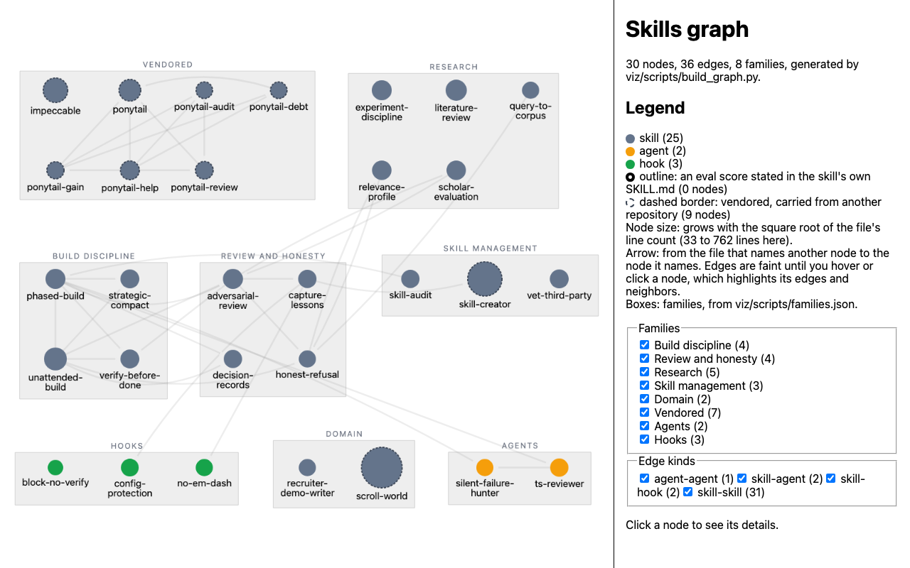
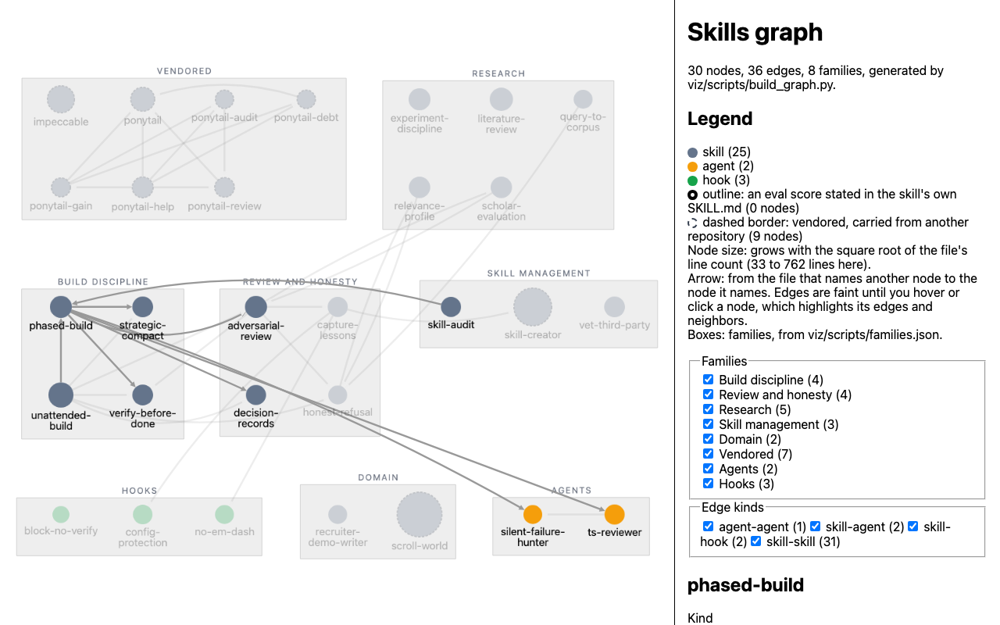

# viz: skills graph

A static page that shows every skill, agent, and hook in this repo as a node, clustered by family, with the references between them. The data in `data/graph.json` is generated from the files by `scripts/build_graph.py` and is never edited by hand.





`screenshot.png` is the default view, with nothing selected or hovered. `screenshot-focus.png` shows `phased-build` selected, which is also what hovering a node does. Both are written by the smoke test below.

- Regenerate the data: `python3 viz/scripts/build_graph.py` (from the repo root; standard library only).
- View the page: `python3 -m http.server 8123 --bind 127.0.0.1 --directory viz`, then open http://127.0.0.1:8123/. It needs a server because the page fetches `data/graph.json`, which browsers block from `file://`. `--bind 127.0.0.1` keeps the server off the network.
- Run the extractor tests: `python3 -m unittest discover viz/scripts`.
- Run the page tests (no browser): `node --test viz/scripts/test_app.cjs viz/scripts/test_panel.cjs`. `test_panel.cjs` runs the real `app.js` against a small fake DOM, taps every node, and checks each detail panel against `graph.json`; it checks the page's logic, not its drawing.
- Run the layout test (headless Cytoscape, no browser): `node --test viz/scripts/test_layout.cjs`. `npm test` in `viz/` runs all three Node test files.
- Smoke-test the rendered page: install the dev-only Playwright once with `cd viz && PLAYWRIGHT_SKIP_BROWSER_DOWNLOAD=1 npm ci --ignore-scripts` (pinned to 1.63.0 in `viz/package.json`; it drives Chromium build 1243, which must already be in the Playwright browser cache, or run `npx playwright install chromium` to fetch it). Then, with the server above running, `node viz/scripts/smoke.mjs http://127.0.0.1:8123/`. It checks the rendered node, edge, and family counts against `graph.json`, checks that no two family boxes overlap, that boxes read from most members to fewest, that no box ends with a lone member in its last row, and that no empty rectangle covers more than a tenth of the canvas (on a 16 by 16 grid), checks each node's color against its kind and the outline against its eval status, checks the legend, checks that the smallest node label is at least 13 px as drawn and that every family label is uppercase, letterspaced, gray, and 11 px, that no label covers a node circle, that the graph fits the viewport, and that no edge is drawn over a node it does not connect, checks every family and edge-kind filter by the exact set of elements it hides (plus one combined case), checks the opacity of every node and edge with no focus, on hover, with a selection that persists after the pointer leaves, and after clearing it, checks the outline on a copy of the data in which one skill states a score, clicks the most-connected node, checks every field and edge in the detail panel with the same contract as `test_panel.cjs` (`scripts/panel-check.cjs`), and writes `viz/screenshot.png` (nothing selected) and `viz/screenshot-focus.png` (`phased-build` selected).

The page (`index.html`, `app.js`, `style.css`) uses Cytoscape.js 3.34.3, vendored in `vendor/` with its MIT license; provenance and the reason for the choice are in `docs/decisions/0001-graph-library-cytoscape.md`. Families are compound nodes; each family gets its own cell, sized by member count, and its members are placed in the cell with Cytoscape's built-in `grid` layout, animation off, so family boxes never overlap. A family with n members uses ceil(sqrt(n)) columns, widened until its last row holds more than one member (so 7 members are 4 + 3, not 3 + 3 + 1). Cells are ordered by member count, largest first, and packed into rows (first fit, by decreasing height); every row width in a range is tried and the packing that fits the viewport at the largest zoom wins. The graph is fitted to the viewport on load. Edges are straight unless a straight line would pass over a node the edge does not connect, which would read as a reference that does not exist; such an edge is bent around it, and the bend is checked against the path Cytoscape actually draws. Edges are drawn faint by default; hovering a node, or selecting it with a click, draws that node's edges and neighbors at full opacity and dims every other node. Clicking empty canvas clears the selection. Nodes are colored by kind with a quiet palette: slate for skills (`#64748b`), amber for agents (`#f59e0b`), green for hooks (`#16a34a`), Tailwind's slate-500, amber-500, and green-600; a node whose own SKILL.md states an eval score gets a black outline (none does today); a vendored node gets a dashed border. Node size grows with the square root of the file's line count. Node labels sit below their node and wrap at hyphens; after the fit their size is set from the zoom so they draw at 13 px or more. Family labels are uppercase, letterspaced with thin spaces (canvas text has no letter-spacing), gray (`#6b7280`), and drawn at 11 px. A legend in the side panel says what color, outline, size, arrows, and boxes mean, and the panel filters by family and by edge kind. Otherwise styling is plain on purpose: system font, white background.

## graph.json

```
schema_version  1
generated_by    "viz/scripts/build_graph.py"
families[]      id, label, rule ("families.json"), file, line
nodes[]         id, kind (skill | agent | hook), name, description, path, lines, family, vendored,
                origin, license_notice, eval_status, eval_line (skills), coverage (hooks)
edges[]         id, source, target, kind (skill-skill | skill-hook | skill-agent | agent-skill | agent-agent),
                file, line, lines
```

A field that cannot be derived from a file is omitted, never filled with a guess.

## Rules

### Which files are nodes

- **Skill:** every file named exactly `SKILL.md` (case-sensitive, read from directory listings) under the repo root, outside the top-level `.git/` and outside any `node_modules/`. This is the same set as `find . -name SKILL.md -not -path "./.git/*" -not -path "*/node_modules/*"`. `node_modules/` is skipped because installed dependencies can ship their own SKILL.md files: `playwright-core` 1.63.0, installed under `viz/node_modules/` for the smoke test, ships three. A skill must have frontmatter with a `name`; a SKILL.md without one fails the build, because its incoming edges would otherwise vanish without notice.
- **Agent:** every file under `agents/`, recursively, outside any `node_modules/` (the same set as `find agents -type f -not -path "*/node_modules/*"`). An agent without a frontmatter `name` uses its file name.
- **Hook:** every script registered in `hooks/settings.example.json`, whatever its extension. `hooks/_input.js` (a shared helper) and `hooks/test-hooks.js` (the test runner) are not registered, so they are not nodes. Any other script in `hooks/` that is not registered is named in a warning on stderr and not graphed. A settings file that is not `{"hooks": {event: [{"matcher", "hooks": [{"command"}]}]}}`, or a command that names no script under `hooks/`, fails the build.
- The script recounts skills, agents, and hooks a second way (a different directory traversal, and hook references counted in the raw settings text rather than the parsed JSON) and fails if the node count differs.

### Node fields

Files are read as UTF-8; a leading byte-order mark is ignored.

- **name, description:** the frontmatter fields of the same names. Plain, quoted, and block (`>` or `|`) scalars are read.
- **lines:** the number of lines as Python's `str.splitlines()` counts them. This is one more than `wc -l` when a file has no trailing newline (for example `impeccable/SKILL.md`).
- **family:** read from `viz/scripts/families.json`, an explicit taxonomy: build-discipline, review-and-honesty, research, skill-management, domain, vendored, agents, and hooks, each listing its members by name (a skill's or agent's frontmatter `name`, a hook's file stem). Families appear in the file's order. The build fails if a node is not listed, if the file lists a name that is not a node, if a name is listed twice, or if the file is malformed, so a new or renamed skill cannot land in a default family. To add a skill, add its name to one family in that file.
- **vendored:** `true` for every node named in the `"vendored"` list in `viz/scripts/families.json`, otherwise `false`. The list is separate from the families, so a vendored skill can stay in the family that describes what it does: today it names impeccable and the six ponytail skills (the vendored family), plus skill-creator (from anthropics/skills) and scroll-world (from oso95/scroll-world), as README.md records. A name in the list that is not a node, a name listed twice, or a malformed list fails the build. The page draws vendored nodes with a dashed border.
- **origin:** the first body line that starts with "Adapted from", "Vendored from", or "Written for this repo" (hooks: a `// Adapted from` or `// Idea from` comment). `license` is the first license name in that line, matched as `MIT`, `Apache 2.0` (or `Apache License 2.0`), `BSD-<n>-Clause`, or `GPL-<n>`. If there is no such line but the frontmatter has a `license` field, origin is `{"from": "frontmatter", "license": ...}`. Otherwise it is omitted.
- **license_notice:** the line in `licenses/ECC-LICENSE` that lists the node by skill name or by path, with the license named in that file.
- **eval_status** (skills only): `measured: <score>` when a body line outside fenced code states a pass rate or score written as `N/M` or `N%`, for example "pass rate 8/8" or "scored 92%". Otherwise `unmeasured`. "Each criterion is scored 1 to 10" does not match, because "1 to 10" is not written as `N/M` or `N%`; a scoring instruction that is written that way ("scored 7/10 when it meets the bar") would match, so the rule is a heuristic. Today every skill is `unmeasured`. `ponytail-gain` quotes published benchmark medians for `ponytail`, but those are figures about another skill and are not written as a pass rate or score, so neither node is marked measured. Vendored skills may carry upstream claims, such as those benchmark medians, that this graph does not verify.
- **coverage** (hooks): the event and tool matcher each hook is registered for in `hooks/settings.example.json`.

### Edges

Every edge has a `kind`, `<source kind>-<target kind>`:

- **skill-skill** (a defer edge): the body of one SKILL.md names another skill.
- **skill-hook**: a skill body names a hook file, by its stem (`no-em-dash`) or file name (`no-em-dash.js`).
- **skill-agent**: a skill body names an agent.
- **agent-skill**: an agent body names a skill. None exist today.
- **agent-agent**: an agent body names another agent.

A name used by more than one node kind (for example a skill and an agent both called `reviewer`) makes mentions ambiguous, so the build fails.

"Names" means, for every kind:

- Body only. Frontmatter is excluded, so a name in a description does not count.
- An exact, case-sensitive whole-token match. The name must not be preceded by a letter, digit, `_`, or `-`, and must not be followed by a letter, digit, `_`, or a `-` that continues the token.
- A node never has an edge to itself.
- There is one edge per (source, target, kind). `line` is the first match, and `lines` lists every matching line in the source file.

False positives excluded by this rule:

- A name inside a longer hyphenated token: `ponytail-review` does not create an edge to `ponytail`.
- A different case: a capitalized word such as "Impeccable" at the start of a sentence does not name the `impeccable` skill.

Known limits:

- `lines` lists every token match, so it can include a line where the name is followed by a space and another word. For example, the "ponytail gain" scoreboard header on `ponytail-gain` line 27 is listed as evidence for the edge to `ponytail`. That edge also has prose evidence on lines 30, 32, 33, and 50.

### Em dashes

`graph.json` is written with ASCII escapes. Two source descriptions (`recruiter-demo-writer`, `scroll-world`) contain em dashes; the file stores them as `\u2014` escapes, so it contains no literal em dash. The page shows the source text as written.
